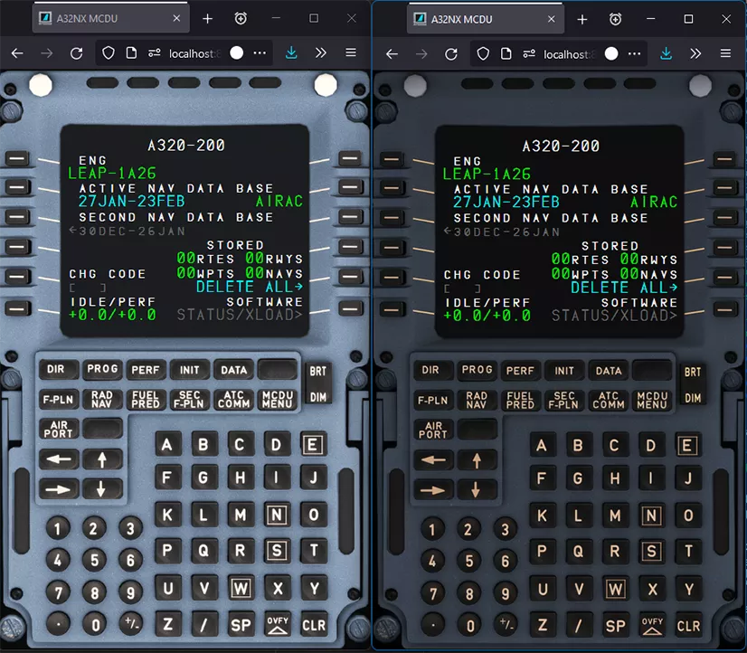
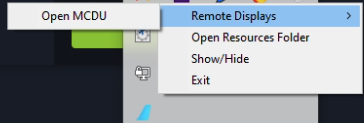

# Remote MCDU Display

<link rel="stylesheet" href="../../../stylesheets/web-mcdu.css">

## Overview

The MCDU Remote display allows you to display and control the MCDU on a browser including browsers on mobile devices like phones or tablets.

See list of compatible and tested browsers: [Compatible Browsers](#compatible-browsers)

!!! note "MCDU Web Interface"
    {loading=lazy}

It also allows you to use your real printer as a cockpit printer for the MCDU.

## Opening the MCDU Remote Display

!!! info Notice
    Ensure SimBridge has [started](../autostart.md#autostart)

- Tray Icon
  - Open the MCDU remote display via the tray-icon
  {loading=lazy}
- Web browser
  - Open your browser of choice and navigate to http://{[IP Address](../troubleshooting.md#network-configuration)}:{[Port](../configuration.md#server-settings)}/interfaces/mcdu
  - for example: `http://192.168.1.21:8380/interfaces/mcdu`

## How to Use the MCDU Remote Display

The MCDU Remote Display can be used by mouse or touch depending on your device.

It is also possible to click on the MCDU screen items themselves to actually click the corresponding LSK (Line Select Key).

You can hold the CLR key for >1.5sec to clear all of the scratchpad's content as it is possible in the cockpit itself.

Changes done in the MCDU Web Interface will be reflected immediately in the cockpit and vice versa. Any change in the cockpit will be immediately shown in the MCDU Web Interface.

!!! info "Notice"
    You can combine several slash commands to get combined effects. For example `/fullscreen/sound` will enable sound *and* fullscreen modes.

### Fullscreen Display

If you only want the MCDU display to be shown then tap on the top-most part of the MCDU display. To return to the full MCDU view tap anywhere on the display.

If you want to start with only the MCDU display visible then add `/fullscreen` to the url.

### Sound

You can enable click sounds when pressing buttons on the MCDU by adding `/sound` to the url.

### Day and Night Mode

It is possible to switch between a day and night mode MCDU visualization be clicking/touching the BRT/DIM button in the Web MCDU.

### 4:3 Aspect Ratio Compatibility Mode

If you are using MCDU hardware with a 4:3 display, you can use the 4:3 aspect ratio compatibility mode to improve the formatting so that the lines align better with your hardware.

To use this mode, add `/43` to the url.

## Compatible Browsers

With hundreds of different browsers available today it is not possible to test and support all browsers and their different versions.

In general we expect this feature to work with the common modern standard browsers on Windows, iOS, Android.

However, there will be browsers where this will not work. In this case we recommend to use a standard browser.

We have tested these browsers (current versions) during the development and these should therefore work ok:

- Windows: Edge, Firefox, Chrome
- iOS: Safari, Firefox, Edge, Chrome, duckduckgo, Brave, Bing
- Android: Chrome, Edge
- Mac OS: Safari, Firefox, Edge, Chrome
- Samsung phone: Chrome, Firefox, duckduckgo
- Linux: Firefox
- Amazon Kindle Fire HD 10 : Silk  (App Version 94.2.2.4606.119.10 Android 5.1.1, Fire OS 5.6.9.0)

{==

Always use the latest versions of the operating system and the browser.

We have not tested older operating systems or browsers and can't support them. They might or might not work.

==}

Known unsupported operating systems or browsers:

- Samsung Internet Browser
- iOS 9.x, iOS 10.x
- Very old browsers not supporting Web Sockets. See [Can I use Web Sockets](https://caniuse.com/?search=web%20sockets){target=new}

## Configuration

Refer [here](../configuration.md) for further configuration.
