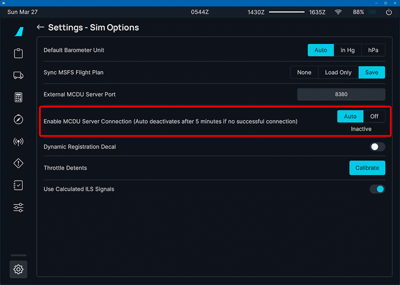

# Remote Display Configuration

## SimBridge Websocket Connection Attempts Timeout

Due to issues in the Microsoft Flight Simulator Coherent Engine (Javascript Engine) continuous connection attempts lead to performance problems for some users because of how the engine handles unsuccessful connections. 

Therefore, a timeout mechanism has been built into displays limiting the number of connection attempts the displays will execute.

A setting in the flyPad EFB Sim Options page has been introduced to allow users to restart the connection attempts or to turn off the attempts to connect to SimBridge completely.

{loading=lazy}

The three settings are:

- Auto:
    - The MCDU attempts to connect to SimBridge for 5min after pressing "Ready to Fly" (`Active` is shown).
    - If this setting is selected the displays will try to connect to SimBridge for 5min after every start of a new flight.
    - After 5min of unsuccessful connection attempts the displays will stop any further attempts and `Inactive` will be 
      shown.
    - If `Inactive` is shown but you want to connect to SimBridge just click on `Off` and then `Auto` again. 
- Off:
    - The displays will not make any attempts to connect to SimBridge.