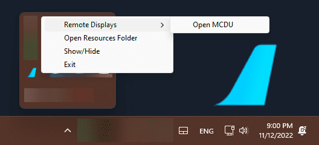

# Remote MCDU Display Guide

<link rel="stylesheet" href="../../../../stylesheets/web-mcdu.css">

## Overview

The MCDU Remote display allows you to display and control the MCDU on a browser, including browsers on mobile devices like phones or tablets.

See list of compatible and tested browsers: [Compatible Browsers](#compatible-browsers)

!!! note "MCDU Web Interface"
    {loading=lazy}

It also allows you to use your real printer as a cockpit printer for the MCDU.

## Opening the MCDU Remote Display

!!! warning "Important Requirements - **READ FIRST**"
    Please note the following requirements before trying to use this feature:

    - SimBridge *must* be [running](../../install-configure/start-simbridge.md#autostart) in order to connect remotely.
    - See [Autostart](../../install-configure/start-simbridge.md#autostart) documentation on how to start it.
    - Check [Troubleshooting](../../troubleshooting.md) if you are having issues.

    !!! tip ""
        The default port is: `8380`

        This is valid for all options listed below. If you would like to change or confirm the port configuration of SimBridge, see our [port configuration documentation](../..
        /install-configure/configuration.md#server-settings). 

### Option 1: simbridge.local

!!! warning "Supported operating systems"
    This feature is only available on Android 12 and newer, recent versions of macOS and iOS, and Windows 10 and 11, but it may work on other operating systems that support mDNS resolution.

    If you are running an older operating system, proceed to [Option 2](#option-2-tray-icon).

You can easily open the Remote MCDU on any supported device connected to the local network by navigating to ==http://simbridge.local:{[PORT](../../install-configure/configuration.md#server-settings)}/interfaces/mcdu== in your browser of choice.

Having issues on a _supported_ device? Make sure Option 2 or 3 works, and if they do, take a look at the [simbridge.local troubleshooting section](../../troubleshooting.md#simbridgelocal-mdns). Otherwise, see the [general network troubleshooting section](../../troubleshooting.md#network-configuration).

!!! tip ""
    If the default port is being used: [http://simbridge.local:8380/interfaces/mcdu](http://simbridge.local:8380/interfaces/mcdu){target=new}

### Option 2: Tray Icon

You can directly open the Remote MCDU from the system tray by selecting "Open MCDU" in the context menu when using ++"Right Click"++ with your mouse.

{loading=lazy}

 You can then copy paste this hyperlink or send it to another device (via browser functions) in order to more easily access the Remote MCDU.

### Option 3: Web Browser

You can also open your browser of choice and navigate to ==http://{[Computer's Local IP Address](https://support.microsoft.com/en-au/windows/find-your-ip-address-in-windows-f21a9bbc-c582-55cd-35e0-73431160a1b9){target=new}}:{[Port](../../install-configure/configuration.md#server-settings)}/interfaces/mcdu==

!!! tip ""
    For example: `http://192.168.1.21:8380/interfaces/mcdu`

## How to Use the MCDU Remote Display

The MCDU Remote Display can be used by mouse or touch, depending on your device.

It is also possible to click on the MCDU screen items themselves to actually click the corresponding LSK (Line Select Key).

You can hold the CLR key for > 1.5 sec to clear all the scratchpad's content, as it is possible in the cockpit itself.

Changes done in the MCDU Web Interface will be reflected immediately in the cockpit and vice versa. Any change in the cockpit will be immediately shown in the MCDU Web Interface.

!!! info "Notice"
    You can combine several display options, described below, to get combined effects. For example, `?fullscreen&sound` will enable sound *and* full-screen modes.

### Fullscreen Display

If you only want the MCDU display to be shown, then tap on the top-most part of the MCDU display. To return to the full MCDU view, tap anywhere on the display.

If you want to start with only the MCDU display visible, then add `?fullscreen` to the URL.

### Sound

You can enable click sounds when pressing buttons on the MCDU by adding `?sound` to the URL.

### Day and Night Mode

It is possible to switch between a day and night mode MCDU visualization be clicking/touching the BRT/DIM button on the Web MCDU.

### 4:3 Aspect Ratio Compatibility Mode

If you are using MCDU hardware with a 4:3 display, you can use the 4:3 aspect ratio compatibility mode to improve the formatting so that the lines align better with your hardware.

To use this mode, add `?43` to the URL.

### Keyboard Mapping

The list shows the supported keyboard inputs and shortcuts for the MCDU Remote Display in a desktop browser.

| Keyboard Code                          | MCDU Key  |
| -------------------------------------- | --------- |
| ++f1++ - ++f6++                        | LSK1-LSK6 |
| ++f7++ - ++f12++                       | RSK1-RSK6 |
| ++a++ - ++z++                          | A-Z       |
| ++0++ - ++9++, ++num0++ - ++num9++     | 0-9       |
| ++tab++                                | DIR       |
| ++insert++                             | PROG      |
| ++home++                               | PERF      |
| ++page-up++                            | INIT      |
| ++enter++, ++num-enter++               | DATA      |
| ++delete++                             | FPLN      |
| ++end++                                | RAD       |
| ++page-down++                          | FUEL      |
| ++escape++                             | MENU      |
| ++left-shift++                         | AIRPORT   |
| ++arrow-left++                         | PREVPAGE  |
| ++arrow-right++                        | NEXTPAGE  |
| ++arrow-up++                           | UP        |
| ++arrow-down++                         | DOWN      |
| ++backspace++                          | CLR       |
| ++space++                              | SP        |
| ++period++, ++num-separator++          | DOT       |
| ++slash++, ++num-slash++               | DIV       |
| ++minus++, ++num-minus++, ++num-plus++ | PLUSMINUS |
| ++num-asterisk++                       | OVFY      |

## Compatible Browsers

With hundreds of different browsers available today, it is not possible to test and support all browsers and their different versions.

In general, we expect this feature to work with the common modern standard browsers on Windows, iOS, Android.

However, there will be browsers where this will not work. In this case, we recommend using a standard browser.

We have tested these browsers (current versions) during the development and these should therefore work ok:

- Windows: Edge, Firefox, Chrome
- iOS: Safari, Firefox, Edge, Chrome, DuckDuckGo, Brave, Bing
- Android: Chrome, Edge
- macOS: Safari, Firefox, Edge, Chrome
- Samsung phone: Chrome, Firefox, DuckDuckGo
- Linux: Firefox
- Amazon Kindle Fire HD 10 : Silk  (App Version 94.2.2.4606.119.10 Android 5.1.1, Fire OS 5.6.9.0)

{==

Always use the latest versions of the operating system and the browser.

We have not tested older operating systems or browsers and can't support them. They might or might not work.

==}

Known unsupported operating systems or browsers:

- Samsung Internet Browser
- iOS 9.x, iOS 10.x
- Very old browsers not supporting Web Sockets. See [Can I use Web Sockets](https://caniuse.com/?search=web%20sockets){target=new}

## Configuration

Refer [here](../../install-configure/configuration.md) for further configuration.
