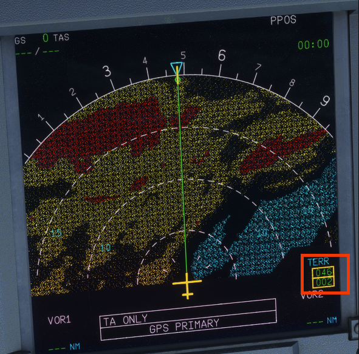
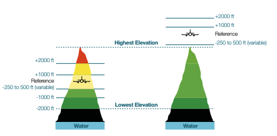

# Terrain Display
{loading=lazy}

!!! danger "Experimental-Only"
    This feature is only available on [experimental](../fbw-a32nx/support/exp.md)

The Terrain Awareness and Warning Systems (TAWS) is a system used to alert the flight crew in a timely manner of hazardous situations ahead of the airport to avoid Controlled Flight Into Terrain (CFIT). A part of TAWS is to overlay the approach terrain on the [ND](../pilots-corner/a32nx-briefing/flight-deck/front/nd.md), refered to as Terrain Awareness and Display (TAD), for the awareness of the crew. this display is derived from a database and subsequently can be out of date which can lead to TAWS making false positives and general nuisances to the crew.

!!! warning "Note"
    SimBridge *must* be [running](autostart.md) in order for the Terrain Display to function

# Terrain Database
The aforementioned database has a worldwide coverage and is defined accoreding to a standardized Earth Model, dividing the surface into grid sets. Several optimisations have been made to the database to deal with size constraints within the aircraft.

- En-route
    - 3.0NM resolution
- 22NM from airports
    - 0.5NM resolution
- within 6NM from airports
    - 0.25NM resolution

## Enabling the Terrain Display

The Terrain Display can be enabled on either the `left` or `right` [Navigation Display](../pilots-corner/a32nx-briefing/flight-deck/front/nd.md). To enable the display, push the `TERR ON ND` [pushbutton](../pilots-corner/a32nx-briefing/flight-deck/front/nd.md#terr-on-nd-pushbutton) and the display will begin to overlay the terrain ahead of the aircraft in a sweeping motion.

## Usage
The display contains different several details and understanding these details will allow you to effectively use the display as-well as understanding it's faults. If the aircraft is descending more than 1,0000 ft/min then the display provides a 30 second advance display for better projection.

### Modes
The TAWS provides two different modes of terrain display on the ND.

#### Standard Mode
The terrain is displayed according to the vertical displacement between the terrain elevation and the aircraft's current altitude. If the aircraft is more than 2,000ft above the terrain, no terrain information is displayed

#### Peaks mode
In this mode terrain is displayed with regards to the absolute terrain elevation (referring to the sea level instead of the aircraft elevation). It aims to improve terrain awareness of the flight crew. If the aircraft is more than 2,000 ft above the terrain, the terrain is still displayed but with a gradient of green (see right-side of image [below](#colors)). It also displays the highest and lowest terrain elevations as two figures in the bottom right corner of the display.

### Colors
The TAWS displays the surrounding terrain on the ND according to the aircraft's current altitude with color-coding to help provide an understanding to the crew to where they are in relation to the terrain.

{loading=lazy}
