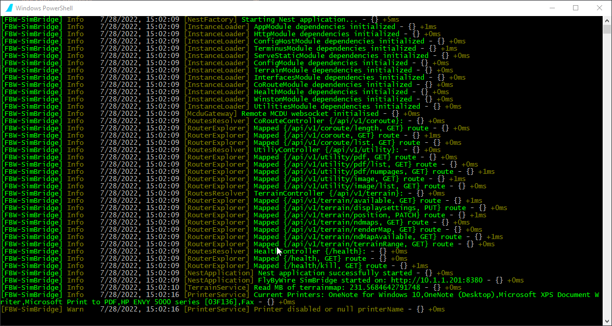
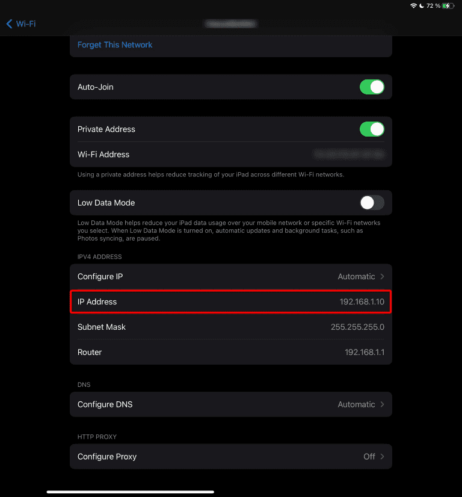
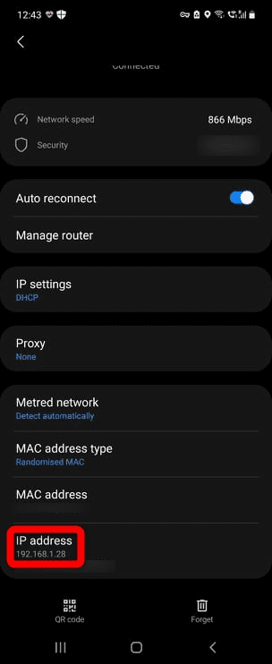
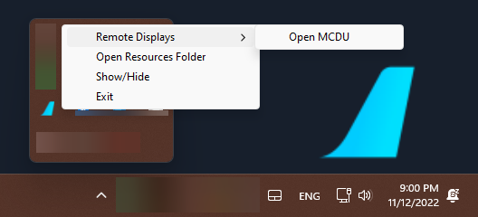

# Troubleshooting

## Main Window
By default SimBridge's main window starts hidden to the systems tray, to view it select `Show/Hide` on the systems tray icon.
{loading=lazy}

The main window running SimBridge displays the servers log file information and provides important information about the started services, the necessary urls and ip addresses.

!!! info "Note"
    This window does not need to remain open and can be re-hidden using the system's tray icon.

    !!! warning "Windows 11 Changes"
        A recent update to Windows 11 made `windows terminal` the default console (replacing `console host`). Unfortunately, at this time `windows terminal` does not support being minmized to the tray.

!!! warning "Notice"
    If the main window is closed (via the (X) button), SimBridge will be closed entirely and will need to be [restarted](autostart.md#manual-start).

## Network Configuration

To access SimBridge's remote displays from a remote device you need to make sure that this device is on the same network as the PC running the MCDU Server.

This is typically the case if both, the PC and the device use the same Internet router and the same WiFi.

To check this you can look at the IP address the MCDU server has listed in its [main window](#main-window) while starting.

[//]: # (Or check it as described here: [Find your IP address in Windows]&#40;https://support.microsoft.com/en-au/windows/find-your-ip-address-in-windows-f21a9bbc-c582-55cd-35e0-73431160a1b9&#41;)

In the example above the IP address is `192.168.1.19`.

??? tip "Examples for Device Network Information (click to expand)"
    **iPad:**

    {loading=lazy}

    **Samsung Android:**

    {loading=lazy}


!!! tip "Alternate Method: Open MCDU from Tray"
    You can also directly open the Remote MCDU from the system tray by selecting "Open MCDU" in the context menu when using ++"Right Click"++ with your mouse.

    {loading=lazy}

    You can then copy paste this hyperlink or send it to another device (via browser functions) in order to more easily access the Remote MCDU.

If you still can't connect to SimBridge's remote displays your firewall might be blocking the traffic. See next chapter.

## Firewall Configuration

!!! danger "Disclaimer"
    Changing Windows settings, especially security settings like the firewall comes with certain risks. Please do not change these settings if you are not comfortable doing so. FlyByWire Simulations does not take any responsibility for any issues caused by your changes to Windows or security settings.

If you can't reach SimBridge's remote display from your browser on your device or on your local PC then it is very likely that your PC firewall is blocking this network traffic.

To test and confirm this turn off your firewall and try again to reach a [remote-display](remote-displays/remote-mcdu.md) via your browser. If you now can access your MCDU from your browser you have confirmed that it is indeed the firewall that blocks this access.

{==

 **Turn the firewall back on again.**<br/>
 *(never run a PC without a firewall)*

==}

We now know we need to open the port we want to use. The default port is **TCP 8380** and this must be allowed to pass the firewall.

There are several ways to open ports on your PC firewall.

For the Windows Firewall you can follow this guide here:

[Opening a Port on Windows Firewall Instructions](https://www.howtogeek.com/394735/how-do-i-open-a-port-on-windows-firewall/){target=new  .md-button }

Alternatively you can open a Command Line prompt as Administrator and use this command:

``` cmd title="Windows Powershell"
netsh advfirewall firewall add rule name="Local API Server" dir=in action=allow protocol=TCP localport=8380
```

For an advanced guide of this command see the Microsoft documentation:<br/>
[netsh advfirewall firewall](https://docs.microsoft.com/en-US/troubleshoot/windows-server/networking/netsh-advfirewall-firewall-control-firewall-behavior){target=new}

??? warning "Remove Autogenerated Rules (click to expand)"
    Sometimes Windows has already automatically generated some rules after showing you a firewall dialog when starting SimBridge.

    If you still can't connect to SimBridge these rules might be the cause. After adding your own rule as described above you don't need these anymore and they can be deleted.

    They usually look like this:

    {loading=lazy}

    Windows Dialog creating these automatic rules looks likes like this:
    {loading=lazy}

This should now allow access from your browser to SimBridge's remote display.

## Occupied Port

Sometimes the default ports 8380 is already used by other services on your PC.

In this case you should get error messages similar to this:

``` cmd title="Windows Command Line"
Error: listen EADDRINUSE: address already in use :::8380
```

??? tip "How To Check If a Port is Already In Use? (click to expand)"
    You can see if a port is occupied by making sure the Local API Server is off and then running this command:

    Windows Command Line:
    ``` cmd title="Windows Command Line"
    netstat -ano | find "8380"
    ```
    or
    Windows Powershell:
    ``` cmd title="Windows Powershell"
    netstat -aon | findstr 8380
    ```

    If the corresponding port is already in use the output should be similar to this:
    ``` cmd title="Output"
      TCP    0.0.0.0:8380       0.0.0.0:0              LISTENING       4
      TCP    [::]:8380          [::]:0                 LISTENING       4
      ...
    ```

If the port is indeed already occupied then you need to change the default port in [SimBridge Configuration](configuration.md#server-settings).

You also need to change the port in the [flyPad EFB Sim options page](../fbw-a32nx/feature-guides/flypados3/settings.md#sim-options).

Of course now the firewall might need to be opened for this new port.

## Logfile
The logfile contains all of the messages printed by the main window as-well as debug messages.

The log file is stored in a file in this folder, formatted by date:
```
<YOUR_COMMUNITY_FOLDER>\flybywire-externaltools-simbridge\resources\logs
```
Please send us the latest logfile to the support channel on discord or on github issues if you're facing issues using the SimBridge's features.

## Installation and Upgrade

Sometimes the installation or the upgrade of Simbridge will fail with an Error during the [Installation](installation.md). This happens when Simbridge is still running in the background, even though the Installer indicates it isn't.

Use the Windows Task Manager to stop the Simbridge process as described in the [Stopping Simbridge](autostart.md#stopping-simbridge) documentation and then run the installation or upgrade again.