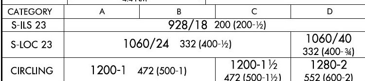
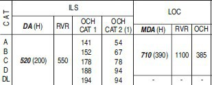
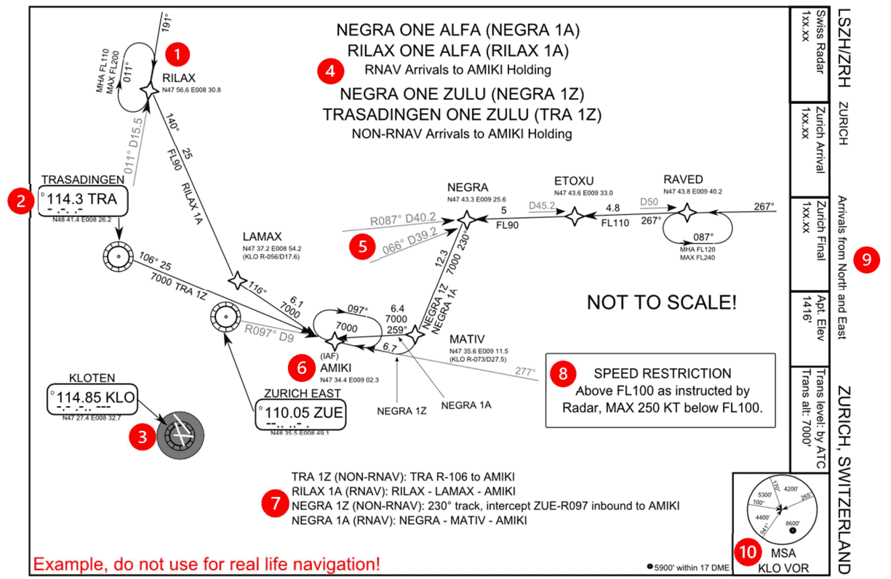
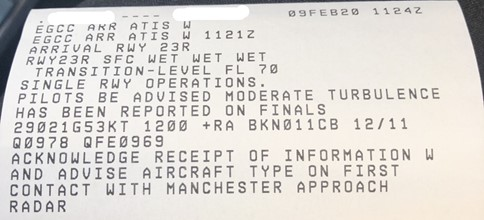

# Airliner Flying Hints and Tips

This is a rough basic guide to general airliner terminology and flying techniques that can be generally applied to most aircraft in the simulator, with a focus towards the Airbus A320 Family and the FBW A32NX mod.

**For Simulation Use Only**

***

## Types of Approaches Available

To land any aircraft, the first step is to start an approach that will bring you to a position where you can see the runway. There are a multitude of different approaches, divided into three terms, precision, non-precision and approach with vertical guidance.

Depending on what equipment the airfield has, what the aircraft is capable of, what the pilot is certified to do and the weather that is on the airfield will determine which of these approaches you will do. Here are some of the more common ones you may see in an airliner.

### ^^Precision Approaches \(PA\)^^

A precision approach will give you full guidance, both vertically and laterally, to guide you down to a point where you can see the runway. This information can come from a set of radio beacons on the ground, satellite information or from a controller.

| Approach Type | Equipment Used | Used For |
| :-------------: | :--------------: | :--------: |
| Instrument Landing System \(ILS\) | A localiser and glideslope radio beacon | Most precise available, the most common for airliner operations.|
| GBAS Landing System \(GLS\) | GPS Satellite systems and ground transmitters | A new alternative to ILS, for difficult approaches |
| Surveillance Radar Approach \(SRA\) | A radar dish and a controller | Commonly as a backup, or at military airfields |


<sub> Lucash, <a href="https://creativecommons.org/licenses/by-sa/3.0">CC BY-SA 3.0</a>, via Wikimedia Commons

***

#### ^^ILS^^


<sub> ILS DiagramSimplified, U.S. Dept. of Transportation, Federal Aviation Administration, Public domain, via Wikimedia Commons

Using a localiser beacon at the end of the runway, and a glisdeslop beacon at the side, the aircraft is guided along two radio signals to the touchdown point. These can be accurate enough to position the aircraft all the way down to touchdown and steer it along the runway. The pilots need to tune the ILS frequency into their aircraft's radio navigation system to receive the correct signals.

#### ^^GLS^^

Like an ILS, but instead of using a set of radio beacons, the aircraft is guided by being fed information from a set of ground stations, which are in turn fed details about the position of the aircraft through GPS satellites.

Not common, but as they do not need radio signals that go out in straight lines, the station can guide the aircraft around curves and turns to avoid terrain and built up/sensitive areas. Only some aircraft are equipped to do GLS and is only an option on the A320 family.

#### ^^SRA^^

This is an approach where a controller, with an advanced radar, steers you towards the runway while telling you corrections to your heading or altitude. To the pilot, the controller will give you corrections such as, “Left 2 degrees”, “Right 3 degrees”, “Slightly high, correcting”, to bring you towards the runway.

When all other systems fail, this system can be used as a backup to provide these kinds of approaches, and several large international airports will practice these to keep the controllers skills current. Military airfields commonly use them as they can be setup much quicker than an ILS for use in temporary airfields and only rely on a radar, which can be portable.

***

### ^^Non-Precision Approaches \(NPA\)^^

A non-precision approach officially can only give you lateral guidance to the point where you can see the runway. This is fed either to the pilots either using a single radio beacon or by satellite navigation, but these cannot tell you if you are too high or low. The only way is to use a table off an aviation chart that shows you at what altitude you need to be at certain distances.

| Approach Type | Equipment Used | Used For |
| :-------------: | :--------------: | :--------: |
| Localiser Only \(LOC\) | A localiser that would be part of an ILS system normally | Some airports only have localiser but also when ILS glideslopes have failed. |
| VOR-DME or VOR Only | A VOR beacon with/without a distance from a DME | Old style approaches, where ILS cannot be used. |
| NDB-DME or DME Only | A NDB beacon with/without a distance from a DME | Old style approaches, where an ILS cannot be used |
| LNAV Only | GPS or the Aircrafts position inside the flight management computers | Approaches where there are no radio beacons in the area |
| Visual | Pilots eyeball! | Where there is no issue with the weather and the runway is already in sight |

These approaches are all flown traditionally with just a beacon pointer or the localiser giving left/right corrections. With a helpful co-pilot who will be using the altitude table to check if you are high or low, you keep correcting down towards the runway. As the term non-precision hints, these approaches are nowhere near as accurate as a precision approach and as such can require quite good weather to be able to attempt them. VOR and NBD beacons are slowly disappearing due to maintenance costs and the more useful APV approaches being made available.

***

### ^^Approaches with Vertical Guidance \(APV\)^^

A newer kind of approach, that uses both lateral and vertical guidance from sources such as GPS satellites, and does not require the use of radio beacons at all. At time of writing, these approaches were not yet classed as precision, as they do not quite have the accuracy required but are constantly getting better with each new design. They are now flown very similarly to an ILS and do not require much input from the pilots.

| Approach Type | Equipment Used | Used For |
| :-------------: | :--------------: | :--------: |
| RNP/RNAV | Satellite GPS systems and the aircrafts on board positioning system | Approaches where there are no radio beacons in the area |
| RNP-AR | Satellite GPS systems and the aircrafts onboard positioning system | As per RNP/RNAV but allow curved approaches with margins as little as 0.1 NM. |

***

## The Different Categories of ILS

With the ILS system, there are several categories that have different requirements from the pilots, the aircraft, the weather and the airport equipment. They are known as CAT, short for category, and are listed as both roman numerals and Latin numbers:

| ILS Category | Autoland Required <br>\(in the Airbus\) | Weather <br>\(Normally\) | MDA or DH |
| :-------------: | :--------------: | :-----------: | :----------: |
| CAT 1 / CAT I | No <br>\(May also be unsafe due to interference\) | Cloud base above 200ft <br>Visibility 550m | MDA |
| CAT 1 LTS / CAT I LTS <br>\(Lower Than Standard\) | Yes | Cloud base above 200ft <br>Visibility 400m or 450m | MDA |
| CAT 2 / CAT II | Yes | Cloud base above 100ft <br>Visibility 300m | DH |
| CAT 3A / CAT IIIA | Yes | Cloud base above 100ft <br>Visibility 200m | DH |
| CAT 3B / CAT IIIB | Yes \(2 Autopilots\) | Cloud base above 50ft <br>Visibility 75m | DH <br>\(can be 0\) |
| CAT 3C / CAT IIIC | Yes \(2 Autopilots\) | Cloud base above 0ft <br>Visibility 0m | DH <br>\(can be 0\) |


As the weather gets progressively worse, the higher the category you need to use, which in turn
requires more advanced equipment both on the airfield and in the cockpit. To be able to do this,
pilots are required to retrain on low visibility operations every year.

The CAT 3C can be performed without ever seeing anything at all but this is not in practice yet
as there has not been designed a system for the aircraft to be able to leave the runway and go to
the parking stands completely blind. The A320 family are capable of everything including CAT
3C.


<sub> MichaelDiederich CC BY-SA 3.0

---

## Minimums and MDA/DH

So, you have picked your approach and are flying towards the runway, but how close can you get before you decide it is a bad idea and to try again somewhere else? This is where the minimums come into effect. These are fixed values that decide how low you can go on the approach, and when you get to this altitude, you cannot go any lower until you can see the runway.

| Minimum Type | Defined As | Approaches Used In |
| :-------------: | :--------------: | :-----------: |
| MDA <br>\(Minimum Decision Altitude\) | Altitude Above Mean Sea Level | CAT 1 / CAT 1 LTS ILS <br> VOR, NDB, RNAV, RNP, Visual, SRA  |
| DH <br>\(Decision Height\) | Height Above the Ground | CAT 2 ILS <br> CAT 3 A/B/C ILS

These are defined in feet, \(or meters if that airspace uses meter altitudes\) and can be found at the bottom of the aeronautical chart that is published for that approach. Each approach to each airport will have a separate value, changing due to obstacles, terrain, and other things that may get in the way while descending towards the runway.

***

### ^^Aircraft Approach categories^^

Now depending on the aircraft you are flying, depends on the minimums you are allowed to use. These are grouped together by the approach speed of your aircraft, while in normal landing configuration at the maximum landing weight that it is certified to do.

* The higher the maximum weight approach speed means:
* The higher category is required, which means:
* The higher minimums are used.

| Aircraft Category | Approach Speeds | Typical Aircraft |
| :-------------: | :--------------: | :-----------: |
| A | < 91 knots | C172 PA28 SR22 DC3 |
| B | 91 - 120 knots | ATR72 C17 S340 TBM850 |
| C | 121 - 140 knots | A320 A380 737 MD80 |
| D | 141 - 165 knots | A340 A350 747 777 787 MD11 |
| E | 166 - 210 knots | Concorde and specialist military |

***

### ^^MDA/DH on a chart^^


<sub>ILS_RWY_23_KBUF.jpg: The original uploader was Centpacrr at English Wikipedia. Derivative work: Atmoz, Public domain, via Wikimedia Commons


In the above example, which is for the ILS or LOC/DME for Runway 23 at Buffalo Airport, NY in the USA, this chart uses a format designed by the Federal Aviation Administration (FAA) of the USA. Each chart designer unfortunately has slight differences compared to each other, but the basics are usually the same. So, for the above approach:

| | MDA <br>(ft) | Visibility <br> (in 100s of ft (USA)) | Visibility <br>(m) | Height above the ground <br>(ft) |
| -------------: | :-------------: | :--------------: | :-----------: | :-----------: |
| ILS CAT 1 RW23 | 928 | 1800 | 550 | 200 |
| LOC RW23 <br>(Category ABC) | 1060 | 2400 | 730 | 332 |
| LOC RW23 <br>(Category D) | 1060 | 4000 | 1220 | 332 |

<sub> N.b. The brackets in the above image are used by the FAA for military operations, nothing to worry about in an airliner!

In this example, for Paris Charles De Gaulle Airport, ILS or LOC/DME for runway 26L:



<sub>SIA, CC BY-SA 4.0 <https://creativecommons.org/licenses/by-sa/4.0>, via Wikimedia Commons


| | MDA <br>(ft) |  Visibility <br>(m) | Height above the ground <br>(ft) |
| -------------: |  :--------------: | :-----------: | :-----------: |
| ILS CAT 1 R26L | 520 | 550 | 200 |
| LOC 23 | 710 | 1100 | 390 |

As this chart is now designed differently, it has described the MDA as a DA for the ILS. Now this is just a difference between charts and countries, some use one terminology over the other. Also to note is the inclusion of OCH values. These are the obstacle clearance heights of all possible objects on the approach path, so if you descend below this, then there is a possibility of a collision. These OCH values are not used by the pilots in an approach but are used by the professional bodies who design the approaches as to what the minimums values should be.

***

## Reading a Chart

### ^^Chart Sample 1^^

!!! info "Reading Chart Sample 1"

    === "1"

        The category of aircraft allowed to do this approach \(A, B, C & D\).

        The altitude of the airfield (392ft) and altitude of the runway touchdown (317ft)

    === "2"

        A top-down picture of the approach (solid line), go-around (dotted line), dangerous airspace (red area), the airport layout and obstacles nearby.

        A box in the top-left corner showing local holding waypoints (MOPAR) with speed limits (230 knots) and altitude limits (between FL070 and FL110).

    === "3"

        The transition altitude (5000ft).

    === "4"

        The missed approach described in text form.

    === "5"

        The minimums box for this approach.

    === "6"

        A box describing, depending on your groundspeed, how long it will take you to get to the runway from the first point you start to descend and what vertical speed is expected.

    === "7"

        The ILS frequency (108.35), its identifier (DSU) and that is has a DME linked to it. <br> The magnetic variation of the area (0 degrees).

    === "8"

        Special notes for this approach that may be different than normal.

    === "9"

        A side-on view of the approach, with starting altitude (4000ft), inbound course (265 degrees), slope of the glideslope (3.0) and distances to the runway for several points along the bottom.

    === "10"

        A distance-altitude check box, where the altitude you should be at for different distances is described. This is useful to check in case there are any issues with any of the radio beacons you are using.


<sub> SIA, CC BY-SA 4.0 <https://creativecommons.org/licenses/by-sa/4.0>, via Wikimedia Commons

!!! info "NOTE"
    All approach charts, no matter the designer, will have this information provided to you as a bare minimum.

    However, the layout may be significantly different, so a quick 5 minutes to look at the charge can make all the difference before starting an approach.

***

### ^^Chart Sample 2^^

!!! info "Reading Chart Sample 2"

    === "1"

        One of the starting waypoints of the arrival (RILAX), including a holding pattern with Minimum Holding Altitude (FL110) and Maximum (FL200).

    === "2"

        A radio beacon used on this arrival (Trasadingen VOR), with its identifier (TRA), frequency (114.3) and Morse code (-.-..-).

    === "3"

        The airfield that this approach is designed for (Zurich), with the runway layout and an on-airfield radio beacon (Kloten VOR).

    === "4"

        The names of the arrivals and where they terminate (AMIKI).

    === "5"

        The location of the waypoint (NEGRA) defined by radio beacons (TRA & KLO), by the distance and direction from each of them (track 087 at 40.2 nautical miles/track 066 at 39.2 nautical miles).

    === "6"

        The initial approach fix or IAF (AMIKI), which is normally where the arrival will end and the approach chart will start from.

    === "7"

        A text description of the route for each arrival.

    === "8"

        Special notes for this arrival that may be different than normal.

    === "9"

        A box with ATC frequency information, the airport altitude (1416 feet) and the transition level and altitude (by ATC/7000ft).

    === "10"

        The minimum safe altitude (MSA), which below this you are in danger of hitting terrain. This is traditionally based on a 25 nautical mile ring around a VOR beacon (KLO), and different segments are split up by tracks into the beacon.



<sub> El-mejor, CC BY-SA 3.0 <https://creativecommons.org/licenses/by-sa/3.0>, via Wikimedia Commons

***

## Autoland

Autolands are, unlike what the media might want everyone to think, not used all that frequently! The only time it is fully used is in conditions of bad weather, where the clouds are too low or the visibility not far enough to continue to do a normal manual approach. Special rules must be in place to prevent any interference with the aircraft, as this is a precise manoeuvre with not much room for error.

### ^^Rules at airfield^^

To fly an Autoland, the approach you are flying must be a CAT 2 ILS or higher. This means that only certain airfields can perform these, where the localiser and glideslopes have been certified as accurate enough to guide the aircraft to a successful landing. An airfield with anything such as an offset ILS, where the ILS is not aligned with the runway, will not be able to offer an Autoland approach.

The airfield must also be in Low Visibility Procedures (LVPs). This aims to reduce the chance of anything interfering with the ILS signals by reducing the amount of vehicles and aircraft near the runway at any time. Special holding points that are further back from the runway are used, and an ILS critical area is established. The image below is a form of LVP ILS holding point.


<sub> Claudius Henrichs, CC BY-SA 4.0 <https://creativecommons.org/licenses/by-sa/4.0>, via Wikimedia Commons

No vehicles or aircraft are allowed into this area while an Autoland is being made. This has the knock-on effect of slowing down operations at an airfield, as the normal rate of landings is now not allowed to reduce interference. From personal experience, an A380 vacating the runway at 90 degrees was enough to force an A320’s autopilot to disconnect as the ILS signal was lost, which is something you do not want to happen when you cannot see anything!

### ^^Rules on the Aircraft^^

The aircraft must first be certified as capable of doing an Autoland and have all the equipment functioning that it was certified with. Many systems used must have a backup, especially for the very low visibility approaches such as CAT 3B/C, including dual autopilots. If any of these systems fail, the aircraft is normally reduced in its landing capability to a lower Category of ILS. The Airbus has an extra Red warning light in front of the pilot’s eyesight which flashes if any Autoland equipment fails while the aircraft is performing an Autoland. Depending on when this happens, this can force the pilots to do a go-around to prevent an accident.


<sub> UR-SDV (GFDL <http://www.gnu.org/copyleft/fdl.html> or GFDL <http://www.gnu.org/copyleft/fdl.html>), via Wikimedia Commons

Another rule onboard is the banning of the use of personal electronic devices (PEDs). This is required to prevent any sort of interference with the onboard equipment on the aircraft as it is that sensitive to radio signals. Normal approaches do not require this level of protection, so many airlines now allow the use of devices during all phases of flight. As testing all possible devices that a passenger could possibly bring on board is a bit impractical, a complete ban is enforced to cover all potential issues. Nowadays, some aircraft have removed the No Smoking sign and replaced it with a No Electronic Devices sign to account for the change in times. A prerecorded public announcement is usually played and the flight attendants will check for devices being used before the approach is made.


<sub> Norwegian, CC BY 3.0 <https://creativecommons.org/licenses/by/3.0>, via Wikimedia Commons


### ^^Rules for the pilots^^

Pilots must be certified to commence autolands and are regularly tested in simulators to keep them in check. Most airlines require their pilots to do emergency exercises while recertifying their Autoland qualification, including with engine problems and Autoland failures. At the author’s airline, the captain is also required to be the pilot flying during an Autoland, with the first officer calling out changes to the aircraft state and monitoring the performance of the aircraft for any deviation.

In the Airbus, a Quick Reference Handbook (QRH) is carried in the cockpit which includes, as well as emergency procedures, a list of equipment and guidebook briefing to complete an Autoland approach. With the possibility of being so low to the ground without being able to see, in the last stages of an Autoland approach the crew are focused and nonimportant radio calls are ignored to prevent distractions.

The Airbus will have several Flight Mode Annunciators (FMAs) display during an Autoland:

| FMA | Description |
| :-------------: | :--------------: |
| LAND | Appears at 350ft AGL and locks in the final guidance |
| FLARE | At or below 40ft AGL, and flares the aircraft for landing |
| ROLLOUT | On touchdown, keeps the aircraft straight on the runway until the autopilot is disconnected |

***

## SIDs and STARS

As much as an airway might be the highway/motorway of the sky, SIDs and STARs are the roads that lead you to and from it. An airport will have multiple SID/STARs for each runway, which will take you a different direction usually to a waypoint which connects to an airway. The airport will publish a chart for each SID and STAR, which should be checked by the pilots and followed unless cleared to do otherwise.

### ^^SID (Standard Instrument Departure)^^

These are the roads away from the airport, navigating around obstacles while keeping the aircraft safe from others with altitudes. Usually, an IFR clearance that you receive on the ground will have a SID or some form of departure instruction, which will depart you from the runway in use and connect onto the rest of your flight plan.


<sub> By Alexrk2 - own work, usingDigitale Topographische Karte 1:250.000, © GeoBasis-DE / BKG 2016 (GeoNutzV)Strategic noise maps (DF 4 and DF 8), European Environment
AgencyMinimum Noise Routing (SID), opennav.com, CC BY-SA 3.0, https://commons.wikimedia.org/w/index.php?curid=51978317


In the above image, you can see all the possible SID routes out of Munich Airport (EDDM). Although the diagram is a noise map, you can see that all routes have a common part to start with when they leave the runway, until they start turning away to their respective waypoints. This means that the noise of departing aircraft is confined to a particular area as best as possible, hopefully away from built up areas.

### ^^STAR (Standard Terminal Arrival Route)^^

Where a SID is the route out of an airport, the STAR is the way in. Extremely similar in design to the SID, this will route you down from the end of an airway normally, until ending at the start of the approach for the runway you are landing on. A STAR will have a route that also keeps it clear of obstacles/terrain etc and give hard altitudes for the pilot to descend to when cleared. Some of these charts will also have holding patterns listed on them for controllers to keep aircraft out of the way to wait until the flow of traffic allows them to land.

***

## LNAV and VNAV


With the advent of more complex autopilots and reference systems inside aircraft, aircraft systems are now much more capable of knowing their position in three dimensions. From earlier technology such as the CIVA INS, to the complex fully automated RNP approaches without any radio guidance that we have now, the terms LNAV and VNAV have become commonplace within the airliner world.

### ^^LNAV (Laternal Navigation)^^

The earliest form of navigation would involve a compass and looking out of the cockpit windows for landmarks, or possibly setting a heading and correcting for weather over distance.


<sub> By 港湾協会第九回通常総会富山準備委員会 - 港湾協会第九回通常総会富山準備委員会編、『富山県の産業と港湾』、1936年（昭和11年）5月、港湾協会第九回通常総会
富山準備委員会, Public Domain, https://commons.wikimedia.org/w/index.php?curid=49569993


LNAV allows for the aircraft to navigate across the world using fixed points in space, such as waypoints or radio beacons. These are defined using a latitude and longitude which are compared, in basic terms, against the aircraft’s known latitude and longitude to allow navigation towards them.

To know of the position of the aircraft, the Inertial Reference Systems (IRS) are aligned while the aircraft is stationary at the gate which sets a baseline position. This is then updated during flight using tracks and distances from radio beacons or has GPS data fed to it to keep accurate. Without these, as IRS systems are not perfect, the position becomes a guess, and the aircraft will slowly drift off route. This was a particular problem crossing the ocean on older aircraft, where there are no radio beacons and GPS was not invented yet, resulting in the aircraft being possibly miles off course when it eventually arrived overhead land.

### ^^Vertical navigation^^

VNAV allows for an aircraft to climb and descend using a calculated path to optimise the flight. It will maintain restrictions on SIDs and STARs, plan the ToD (Top of Descent) and minimise fuel burn while still allowing for the aircraft to get into a position to land. For VNAV to work correctly, the aircraft’s computer systems must be correctly set with the correct weights, route, weather and performance information.

***

## Noise Abatement (NADP1 vs 2)

To reduce the noise effects on local residents, some airports require the use of noise abatement procedures to help keep the noise levels down. On the airport, the reduction of the use of the APU and using more external power helps, plus the requirement to ban the use of anything more than idle reverse on landing unless the aircraft performance needs it. The big change that prevents a lot of noise is the use of NADP. These Noise Abatement Departure Procedures
change the way aircraft climb out from the airport to help keep noise levels down at buildings that are directly under the flightpath.

NADP1 requires you to climb to your thrust reduction altitude, but instead of accelerating at the same time, you hold the speed until you get to a higher acceleration altitude. This means that over the same distance, you will be higher than the normal procedure, also known as NADP2. And being higher over the buildings means you will generate less noise.

Airports will describe in their airfield documents which departure you should be doing, but the standard method of NADP2 is probably in 80/90% of airports across the world. Common example airports with NADP1 are Paris LFPG, San Francisco KSFO on certain runways and
Geneva LSGG.


<sub> Credit - Shomas [Z] Pilot on Discord
***

## QNH/QFE/STD and in.Hg/hPA

These codes are all related to settings on your altimeter, which can give you several readings depending on what you use.

### ^^QNH and QFE^^

Part of the “Q-codes” created by the British Government in roughly 1909, these are used to set altimeters to a specific reference. These, unlike most acronyms in the aviation world, do not have any direct meaning for their letter combinations, though some instructors think of the letters FE in QFE as being for “field elevation”.

QNH is the setting of the altimeter so that it will read the altitude above mean sea level (MSL). This is to say that if you landed on an ocean, this setting would cause the altimeter to read zero. QNH is the most used reference in airline operations and several airlines ban flying using a QFE reference.

QFE is the setting of the altimeter so that it will read the height above the airport that you are landing or departing from. The aim is for the altimeter to read approximately zero when the wheels of the aircraft touch down on the runway. Very commonly used during General Aviation flying or during early instruction.

### ^^STD^^

STD (standard) is the setting of the altimeter to reference to ISA conditions. ISA is a weather model to set a benchmark for pressure and temperature changes at altitude, and for pilots, this means a QNH of 1013 hPA or 29.92 inhg.

To fly a flight level (i.e., FL350 as opposed to 35000ft), all aircraft are required to be set to STD to remove any chances of differences between QNH causing aircraft to be closer to each other than the altimeters are indicating. The change from being on a QNH to STD happens at the transition altitude, and at the transition level vice-versa. A QNH/QFE is required to be set before landing. To set the STD in the Airbus, pull the dial that sets the altimeter, and push to return to QNH.

### ^^in.Hg/hPA^^

These two acronyms are the measure of the pressure around you, just as much as kg/lbs or cm/feet. In.Hg stands for inches of mercury, commonly used in the USA, Canada and Japan. The rest of the world commonly uses hPA, the hectopascal. The weather reports in the country you are flying to/from, will have the altimeter setting reported in the measure that that country uses.

As you may fly from a country that uses one setting, to another country that uses the other setting, aircraft usually have a dial or switch that will allow the pilots to change from one measure to the other. In the Airbus, this is a turning switch behind the dial that sets the altimeter.

***

## Transition Altitudes and Transition levels

Transition altitudes and levels are the changeover points for the altimeter references to be changed. The transition altitude in the climb, and the transition level in the descent.

### ^^Transition Altitude^^

In the climb, the transition altitude is where you would switch from QNH to STD, and your altitudes will become flight levels. Every clearance ATC will give you above this will be called a Flight Level, and everything below will be called an altitude.

This altitude is found on the departure or arrival charts of the airport you are departing from and will vary from airport to airport except for some countries. Usually, the demands of air traffic control or the terrain around the airfield will define what the altitude will be for that airport. In the USA and Canada, this is fixed at 18000ft to reduce complexity, whereas in other countries such as the UK or the Netherlands, this can be as low as 3000ft.

### ^^Transition level^^

In the descent, this is where you would change from STD to QNH and is vice-versa to the transition altitude. However, depending on the pressure at the airfield on that day, this is not a fixed value and changes to accommodate high- or low-pressure waves. This means it can only be assigned to you by information from ATC, such as using an ATIS or by being told it through radio communications.

In the Airbus, transition altitudes or levels can be selected in the performance page of the MCDU. As you cross over the altitude or level, the altimeter setting on the PFD in front of the pilot will flash to remind them to change over to the new setting. Some airlines only use transition altitudes in their MCDU, even in the descent. A common technique is to change the reference as soon as you are cleared to an altitude or FL, to prevent it being forgotten, as this can cause TCAS issues when aircraft are not separated by safe amounts.


<sub> Christopher Michel, CC BY 2.0 <https://creativecommons.org/licenses/by/2.0>, via Wikimedia Commons

***

## Reading METARs/TAFs/ATIS

### ^^METAR^^

These are weather reports created by an on-airport weather station and tend to be released every 30 minutes for most airports around the world. These have a standard layout as:

<sub>AIRPORT ID - DATE/TIME - WIND - VISIBILITY - WEATHER - CLOUD - TEMP/DEWPOINT - QNH - REMARKS

!!! info "Metar Decoding"

    === "AIRPORT ID"

        It always starts with the airport ID as the 4 letter ICAO code

        * EGLL = Heathrow UK
        * KDEN = Denver, USA etc.

    === "DATE/TIME"

        Then follows the Date and Time in the format of DDTTTTZ. So, the date in two digits, followed by the Zulu (GMT) time in four digits. The time is always referenced in Zulu no matter what time zone you are in. For example: 032050Z = The 3rd day of that month, 20:50Z or 8:50PM GMT time. If this is followed with AUTO, it means that the weather station is publishing the METARs without any intervention or checks by a human controller.

    === "WIND"

        The wind field is written as direction in degrees true followed by the strength in knots. So 36011KT is a wind of 11 knots coming from 360 degrees (north). Some countries still use meters per second (MPS) which will replace the KT so you know which measure is in use. A G can also be added for gusts, e.g. 36011G28KT.

        The letters VRB can replace the direction to say it is blowing in a variable direction. After the wind, there can be two directions with a V in between if a strong variable wind is blowing. 240V350 means the wind is varying between 240 degrees and 350 degrees.

    === "VISIBILITY"

        The visibility field comes next, with prevailing distance in meters in four digits and goes up to 9999 if it is greater than 10km visibility. Some countries use statute miles which will be labelled SM.

        If there is a minimum visibility in a certain direction, this will come next as the same format as the prevailing distance but with a direction afterwards in letters, for example 1500NW will mean that in the northwest direction it is down to 1500m.

        RVR is the final option, which shows the distance you can see down a runway in meters. It will be in the format of the runway designator/meters, and can have a D, N or U to show its decreasing, staying the same or going up, such as R28L/1000D.

    === "WEATHER"

        The weather field can have multiple codes written in it, to describe the current conditions.

        These can be mixed, with the max of one from each column at a time. For Example:

        ```
        -TSRA = Light Thunderstorms and Rain  
        +SHSN = Heavy Showers of Snow
        VCFC = Vicinity Funnel Cloud
        ```

        | First is Intensity | Second is Description | Third is the Weather |
        | -------------: | --------------: | -----------: |
        | Light (-) | Patches (**BC**) | Mist (**BR**) |
        | Moderate \( \) | Blowing (**BL**) | Duststrom (**DS**) |
        | Heavy (+) | Drifting (**DR**) | Dust (**DU**) |
        | Vicinity (**VC**) | Freezing (**FZ**) | Drizzle (**DZ**) |
        | | Shallow (**MI**) | Funnel Cloud (**FC**) |
        | | Partial (**PR**) | Fog (**FG**) |
        | | Showers (**SH**) | Smoke (**FU**) |
        | | Thunderstorm (**TS**) | Hail > 5mm (**GR**) |
        | | | Smart Hail (**GS**) |
        | | | Haze (**HZ**) |
        | | | Ice Crystals (**IC**) |
        | | | Ice Pellets (**PL**) |
        | | | Dust Devils (**PO**) |
        | | | Rain (**RA**) |
        | | | Sand (**SA**) |
        | | | Snow Grains (**SG**) |
        | | | Snow (**SN**) |
        | | | Squalls (**SQ**) |
        | | | Sandstorm (**SS**) |
        | | | Unknown (**UP**) |
        | | | Volcanic Ash (**VA**) |

    === "CLOUD"

        These can be described in a few ways, but with the cloud coverage followed by the height above the airfield in hundreds of feet. Multiple of these can be used at once to show layers.

        **Special Case - CAVOK**

        CAVOK, meaning ceiling and visibility okay, can replace all the visibility, weather and cloud fields if:

        * The visibility is greater than 10KM (written as 9999)
        * No CB or TCU reported
        * No cloud below 5000ft or the highest minimum safe altitude in the area
        * No significant weather

        This is for a clear, calm day with nothing to worry about in terms of weather and is what most pilots flying smaller aircraft look forward to seeing on the METAR report.

        | | Means | Example | Which Means |
        | :-------------: | :-------------- | -----------: | :----------- |
        | FEW | Few clouds (1/8-2/8 of the sky covered) | FEW005 | Few clouds at 500ft |
        | SCT | Scattered clouds (3/8-4/8 covered) | SCT010 | Scattered clouds at 1000ft |
        | BKN | Broken clouds (5/8-7/8 covered) | BKN020 | Broken clouds at 2000ft |
        | OVC | Overcast (completely covered) | OVC050 | Overcast at 5000ft |
        | CB | Cumulonimbus | FEW007CB | Few Cumulonimbus at 700ft |
        | TCU | Towering Cumulus | SCT012TCU | Scattered TCUs at 1200ft |
        | VV | Vertical Visibility (can't see a cloud bas) | VV002 | Can see approx. 200ft up |
        | NSC | No significant cloud | NSC | Nothing to report |

    === "TEMP/DEWPOINT"

        Next is the temperature and dewpoint written as TT/DD. This is always in Celsius and can be listed with an M before each figure to indicate minus. For example, 02/M03 means 2 degrees Celsius with a dewpoint of -3 Celsius

    === "QNH"

        The QNH is next, listed as four digits, started by either a Q for hPA or an A or in.Hg.

    === "REMARKS"

        And finally remarks. These can be quite extensive, especially in the USA, but common ones to keep your eyes out for are:

        | | Means | Example | Which Means |
        | :-------------: | :-------------- | -----------: | :----------- |
        | RE | Recent | RETS | Recent Thunderstorm |
        | WS | Windshear reported | WS RW12 | Windshear on Runway 12 |
        | TEMPO | Temporarily | TEMPO SHRA | Temporarily showers of rain |
        | BECMG | Becoming | BECMG CAVOK | Becoming CAVOK |
        | FM | From | FM 1530 RA | From 15:30Z rain |
        | TL | Until | TL 1630 | Until 15:30Z weather changes |
        | NOSIG | No significant weather | NOSIG | No significant weather to report |
        | NSC | No significant cloud <br>(can also replace the cloud field) | NSC | No Cloud to report |

        Things such as runway friction in contaminated conditions, military colour codes, temperature variations etc. can be labelled in the remarks too but this would be quite extensive to list them all and the ones above are the most common you will see.

### ^^METAR Examples Decoded^^

`EGLL 031150Z AUTO 26004KT 9999 FEW026 OVC035 08/07 Q0994`

London Heathrow, UK, weather recorded on the 3rd day of the month at 11:50Z time. Automatic observation by the weather station. Wind 260 degrees at 4 knots. Visibility 9999m (greater than 10km). Few clouds at 2600ft above the airfield, overcast clouds at 3500ft above the airfield. Temperature 8C, dewpoint 7C. QNH 994 hPa.

`LFPG 031130Z 21018KT 9999 FEW020 BKN024 BKN034 12/08 Q0997 TEMPO 25025G40KT 3000 SHRA FEW015CB SCT020TCU`

Paris Charles de Gaulle, France, weather recorded on the 3rd day of the month at 11:30Z time. Wind 210 degrees at 18 knots. Visibility 9999m (greater than 10km). Few clouds at 2000ft above the airfield, broken clouds at 2400ft above the airfield, broken clouds at 3400ft above the airfield. Temperature 12C, dewpoint 8C. QNH 997 hPa. Temporarily wind 250 degrees at 25 knots gusting 40 knots, 3000m visibility in showers of rain, few cumulonimbus clouds at 1500ft and scattered towering cumulus at 2000ft.

`VHHH 031130Z 10010KT CAVOK 20/11 Q1021 NOSIG`

Hong Kong International, weather recorded on the 3rd day of the month at 11:30Z time. Wind 100 degrees at 10 knots. Ceiling and visibility okay. Temperature 20C, dewpoint 11C. QNH 1021 hPA. No significant weather

`KJFK 031151Z 32012KT 9SM -SN OVC070 M01/M05 A2948 RMK AO2 SNE14B45 SLP981 4/011 P0000 60000 70002 T10111050 11006 21017 53013`

New York JFK, USA, weather recorded on the 3rd day of the month at 11:51Z time. Wind 320 degrees at 12 knots. Visibility 9 statute miles. Light snow. Overcast clouds at 7000ft. Temperature -1C, dewpoint -5C. QNH 29.48inHg. (This is then followed by remarks about the snow conditions and temperature variations, too much detail for this guide).

`EGCC 031120Z VRB2KT 1500 200SW R23R/150D R23L/100N FG VV000 8/8 Q1030`

Manchester, UK, weather recorded on the 3rd day of the month at 11:20Z time. Wind variable at 2 knots. 1500m prevailing visibility, 200m visibility to the south-west. Runway 23R has a visibility of 150m and decreasing, Runway 23L has a visibility if 100m but unchanging. Fog. Vertical visibility of 0, (cannot see upwards due to the fog). Temperature and dewpoint both 8C. QNH 1030hPa.

### ^^TAF (Terminal Area Forecast)^^

A TAF is a forecast of the weather that is going to be at that airport for a length of time. It follows a similar format as the METAR in using the same weather codes but has the addition of timespans and probabilities.

The timespans are written as date/hour, in the format DDTT/DDTT, so 0312/0409 will mean the timespan is from 12Z on the 3rd until 09Z on the 4th.

The probabilities are either 30% or 40%, 30 meaning unlikely and 40 meaning likely. These are written as PROB30 or PROB40. No idea why its these figures, just always has been!

### ^^TAF Example Decoded^^

`EGLL 031100Z 0312/0418 29010KT 9999 BKN024 PROB30 TEMPO 0312/0313 6000 RA BKN012 BECMG 0318/0321 21008KT PROB30 TEMPO 0403/0410 3000 BR BKN003 TEMPO 0410/0418 7000 -RA BKN008 PROB30 TEMPO 0415/0418 3000 RADZ BKN003`

London Heathrow, UK, TAF created at 1100Z on the 3rd day of the month.

Between 12Z on the 3rd until 18Z on the 4th, weather is primarily, wind 290 degrees 10 knots, visibility greater than 10km and broken clouds at 2400ft.

Probability of 30%, temporarily between 12Z and 13Z on the 3rd, 6000m visibility in moderate rain, clouds broken at 1200ft.

Weather changing and becoming, between 18Z and 21Z on the 3rd, wind 210 degrees 8 knots.

Probability of 30%, temporarily between 03Z and 10Z on the 4th, 3000m visibility in mist, clouds broken at 300ft.

Temporarily between 10Z and 18Z on the 4th, 7000m visibility in light rain, clouds broken at 800ft.

Probability of 30%, temporarily between 15Z and 18Z on the 4th, 3000m in rain and drizzle with clouds at 300ft.

What does this all mean to us though? The weather at Heathrow for the next 24 hours or so is going to be a bit wet, with short bursts rain bringing the visibility and cloud down, that is about it really!


<sub> Sheba_Also 43,000 photos, CC BY-SA 2.0 <https://creativecommons.org/licenses/by-sa/2.0>, via Wikimedia Commons

### ^^Atis (Automatic Terminal Information Service)^^

Now using the METAR or TAF is good for seeing what is happening at an airport throughout the day or generally as a guide, but it does not tell us much about what is happening at the airport at the time when we want to land.

This is where the ATIS comes in, which is a message transmitted over a specific radio frequency that gives a spoken reading of the current weather and useful information on the airfield such as the runways in use or if any taxiways are closed. These are always started and ended with a letter, “Information Charlie”, which is told to the departure or approach controllers when you first speak to them to confirm that you have listened to the latest ATIS information. This message changes after so many minutes depending on the airports updating frequency, and when it does, the next letter in the alphabet is then used at the start and end of the new message.

Now to make things easier, Digital ATIS is starting to be used throughout the world, which allows for the aircraft to print out a text version of the ATIS from a distance beyond the range of the radio frequency. This means that the workload in the cockpit is much less, as some ATIS radios can only be received in the descent. Here is an example of a DATIS:


<sub> Credit - Shomas [Z] Pilot on Discord "I guess you can see why I saved this one"

As you can see, this is information W, Whiskey for Manchester, UK EGCC. The weather information is written out in a METAR like format, but with the addition of a QFE as well.

The extra airfield information starting from the top on this particular ATIS is:

* The arrival runway (23R)
* The runway state (Wet at the start, middle and end)
* The transition level (FL70)
* That single runway operations are in effect
* That moderate turbulence has been reported (due to the 53kt wind!)
* And to acknowledge the information and tell them your aircraft type when you first contact the approach controller
