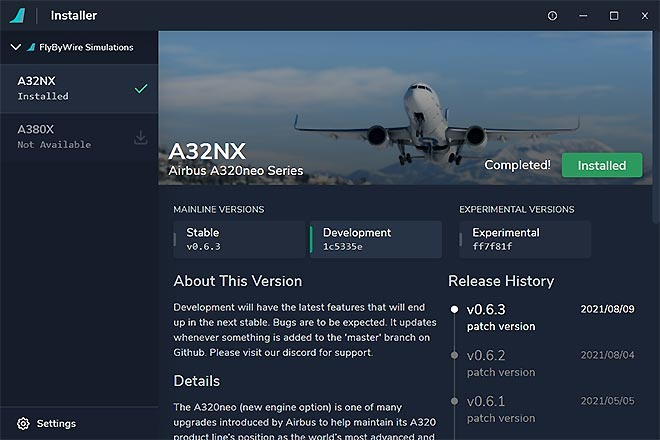
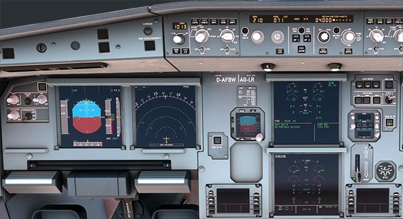

# Support Guide

Microsoft Flight Simulator 2020 is still a rather young flight simulator and many issues still need to be addressed.

The FlyByWire A32NX tries to address many of these issues but it is of course also likely to have issues and bugs itself now and then.

This guide shall help you how to identify and solve these issues by guiding you through a systematic troubleshooting process. These are several sources of information you can check if you experience an issue with the FBW A32NX mod. We will describe each of them in more detail below.

## 1. Learn how to fly an A32NX

!!! warning "IMPORTANT"

The FBW A32NX aims to become a realistic simulation of a real Airbus A320neo. Accordingly as with real pilots some reading and learning is required to gain the knowledge to competently fly this aircraft even in a simulator. Our support channels are not meant to and cannot replace this learning process for you.

A good place to start learning to fly and operate the FlyByWire A32NX is our [Beginner Guide](../beginner-guide/overview.md).

Further help can be found on our [:fontawesome-brands-discord:{: .discord } - **Discord Link**](https://discord.gg/flybywire) in the channel #aviation-chat.

Please make sure you have acquired the knowledge to distinguish a software issue within the A32NX from lack of knowledge on your part. You will help keep our support channel effective for other users reporting actual issues.

## 2. Troubleshoot

Please try and remove all other mods/liveries from the [Community Folder](#community-folder-content) and perform a clean reinstall of the A32NX with the [FlyByWire Installer](https://api.flybywiresim.com/installer). Then start the simulator and check if the problem is still present. This will help rule out mod conflicts.

!!! warning "Please really do this as >90% of all reported issues are caused by conflicts with other mods and liveries, etc. Unfortunately Microsoft Flight Simulator 2020 is very sensitive to conflicts between mods and liveries."

##  3. Research Known Issues

Read the [Reported Issues](reported-issues.md) section - most issues users encounter are already on this list.

If you have a github account please also see [Issues](https://github.com/flybywiresim/a32nx/issues) there. Please also use the search for your particular issue.

Join our Discord server [:fontawesome-brands-discord:{: .discord } - **Discord Link**](https://discord.gg/flybywire) and do the following:

- Read the Pinned Messages for commonly reported issues

    

- Read the Sticky Messages which is automatically posted after each message.

    

- Search in the #support channel for similar issues other users have reported.

    

!!! warning "Please do this research before you post any questions or report any issues."

## 4. Report Issue on Discord

If you can't solve or find your issue with the above steps, you can use our [:fontawesome-brands-discord:{: .discord } - **Discord**](https://discord.gg/flybywire) **#support** channel to get further help.

Please prepare the following before reporting any issues:

- [MSFS Version](#msfs-version)
- [A32NX Version](#a32nx-version)
- [Community Folder Content](#community-folder-content)
- [Screenshot of Cockpit](#screenshot-of-cockpit)

With this information at hand go to our Discord  [:fontawesome-brands-discord:{: .discord } - **Discord**](https://discord.gg/flybywire) **#support** channel and
describe your issue and respond to the questions our support team might have.

!!! warning "Please do some research (see [above](#3-research-known-issues) ) before you post any questions or report any issues."

## 5. Report Issue on the A32NX Github

[:fontawesome-brands-github:{: .github } - **Issues / Feature Requests**](https://github.com/flybywiresim/a32nx/issues)

Follow the issue template as best as you can. The more information you provide the easier it is for our team to understand and reproduce your issue.

Provide at least the following so that our team can reproduce the issue:

- [MSFS Version](#msfs-version)
- [A32NX Version](#a32nx-version)
- Clearly describe the issue in a way a third person can fully understand and reproduce it!
- Include references like screenshots or videos

!!! warning "Be aware that issues that do not follow the template or provide insufficient information might get ignored or closed without any response."

## Collecting Support Information

### MSFS Version

The version of Microsoft Flight Simulator 2020 you are using can be found via several ways:

- In the MSFS main menu you can click on your username in the upper right corner. This will display your version.

    

- Using ++alt+tab++ to see all open windows.

    

- Using the MS Store Update dialog.

    

### A32NX Version

#### Stable or Development

You can determine which version of the FBW A32NX you use by looking at:

- the FlyByWire Installer

    

- the Microsoft Flight Simulator Content Manager

    

#### Build Info

To get the actual build number of your installed A32NX go into your Community folder and open this A32NX file with Notepad:

<your-Community-Folder>\flybywire-aircraft-a320-neo\build_info.json

This should contain something like this:
```
{
  "built": "2021-08-11T07:29:20+00:00",
  "ref": "master",
  "sha": "1c5335ec13ec6b7d29319db3371299da5e4fb880",
  "actor": "developername",
  "event_name": "manual"
}
```

### Community Folder Content

Make sure that before reporting any issues that your [Community Folder](installation.md#community-folder) is completely empty with the exception of the FlyByWire mod (folder name `flybywire-aircraft-a320-neo`).

Make a screenshot of the Community Folder if requested by our support team.

### Screenshot of Cockpit

Quite often when issues during flight are reported a screenshot of the Cockpit will be request by our support team. A good screenshot should contain all screens and the FCU in a sufficient resolution to help the support team to recognize details on the PFD, ND or ECAMs.

#### Example:

{loading=lazy}

#### How to do a good screenshot:

Position yourself in the cockpit using arrow keys (default key mapping) to look straight at the front instrument panel as in the example above and then use the Windows Sniping Tool ( [HowTo](https://support.microsoft.com/en-us/windows/open-snipping-tool-and-take-a-screenshot-a35ac9ff-4a58-24c9-3253-f12bac9f9d44)) to take a screenshot of all screens and the FCU.


