# Throttle Calibration FlyByWire A32NX

!!! warning "Please Note"
    Throttle Calibration is only required and available when using the [Development Version](fbw-versions.md#version-overview)

This guide will help you setting up your throttles for use with the FlyByWire A32NX.

It covers the frequently used [Thrustmaster TCA Throttle Quadrant Airbus edition](#thrustmaster-tca-or-similar-with-reverser-on-axis) with 2 throttle axis, reversers and detents and also the [Thrustmaster TWCS Throttle](#thurstmaster-twcs-or-similar-without-reverser-on-axis-and-no-detents) as an example for a single axis throttle with no reverser and no detents.

## Quick Start

### Step 1: Setup the correct axis in Microsoft Flight Simulator Control operations

- For throttles with reversers map the throttle axis of your controller to `THROTTLE 1 AXIS` and `THROTTLE 2 AXIS`. Do NOT use `THROTTLE 1 AXIS (0 TO 100%)` in this case!
- For throttles without reversers map the throttle axis of your controller to `THROTTLE 1 AXIS (0 TO 100%)` and `THROTTLE 2 AXIS (0 TO 100%)`. Do NOT use `THROTTLE 1 AXIS` in this case!
- Test if you need to set `REVERSE AXIS` - the TCA needs this, others might not.
- Remove any sensitivity and dead zone settings for the throttle axis of your controller. Your throttle should be fully linear.

[Detailed step-by-step Guide ](#step-1-microsoft-flight-simulator-controls-option)

### Step 2: flyPad Throttle Calibration page

- Set `Reverse On Axis` and `Independent Axis` as required for your controller (for the TCA both are ON)
- Move your controller all the way back (with reverser to `Reverse Full`, without reverser to `Idle`)
- Click in the middle on the detent's name to select the detent you want to calibrate
- Click on `Set From Throttle` to set the current throttle position as the value for this detent.
- Repeat for all positions/detents.
- Click `Save & Apply`
- Test your settings.

[Detailed step-by-step Guide](#step-2-calibrating-the-tca-throttle-detents-in-the-flybywire-flypad-efb)

## Thrustmaster TCA or similar (with reverser on axis)

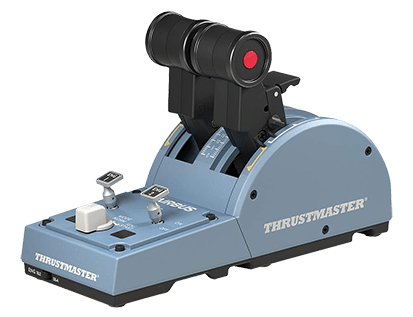{loading=lazy}

### Step 1: Microsoft Flight Simulator Controls Option

Open the Microsoft Flight Simulator Controls Option page.

{loading=lazy}

Use the numbers in this image in the following text.

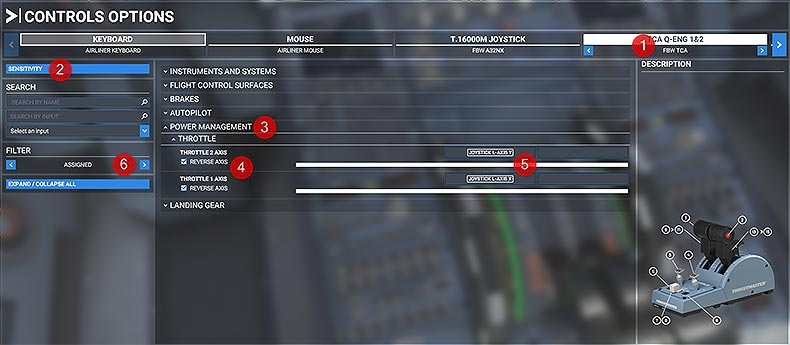{loading=lazy}

- Select the TCA controller **(1)**

- Click on **SENSITIVITY** **(2)**

    Make sure sensitivity setting are set to linear. Set them exactly as per image below.

    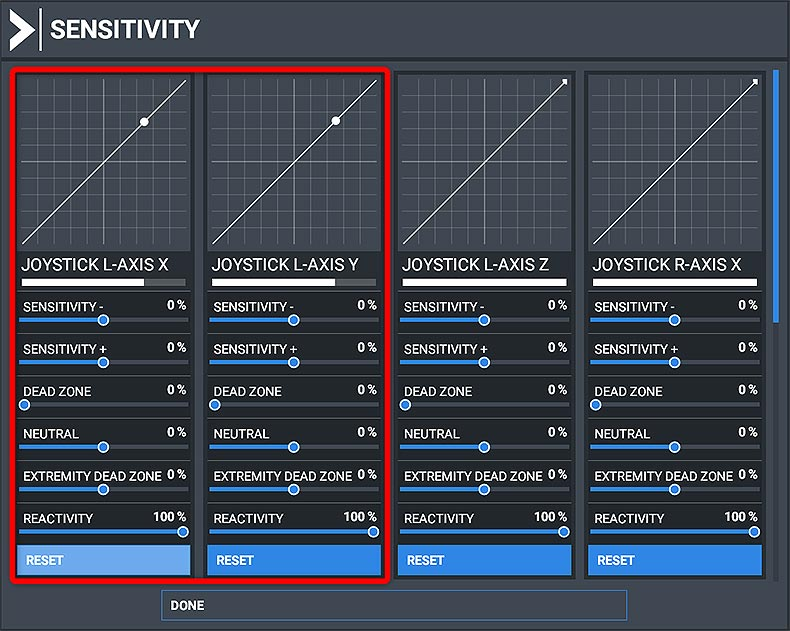{loading=lazy}

    Click on **DONE**

- Open **POWER MANAGEMENT - THROTTLE** **(3)**

    You should see the currently assigned control mappings. If not use FILTER **(6)** to see all controllable attributes.

    !!! warning "Important"
        Make sure **^^NOT^^** to use THROTTLE 1 AXIS (0 TO 100%) or THROTTLE 2 AXIS (0 TO 100%).

        Remove any mapping to these settings by  double clicking the entry and choosing **CLEAR CURRENT INPUT**.

        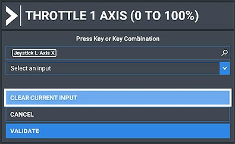{loading=lazy}

    Look for THROTTLE 1 AXIS and THROTTLE 2 AXIS and map it like this **(4)**:

    {loading=lazy}

    Test it by moving the TCA throttle - the white bar should move **(5)**.

- Exit the Control Options dialog and don't forget to **APPLY AND SAVE**!

Now Microsoft Flight Simulator should be setup correctly. The throttles should already move from Full Reverse to TOGA!

Now let's calibrate the detents as they are **NOT** correct yet - continue with the next chapter.

### Step 2: Calibrating the TCA throttle detents in the FlyByWire flyPad (EFB)

#### Full Reverse

- Make sure that your TCA throttles are all the way back to Full Reverse (pull the **Reverse Levers** up to do so).

    {loading=lazy}

- Open the flyPad (maybe pop it out to a separate window next to the throttle with ++ralt+left-button++) and go to **Settings** -> **Calibrate**.

    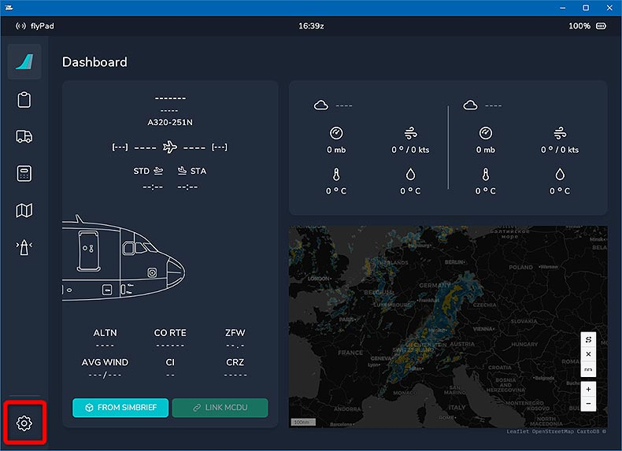{loading=lazy}

    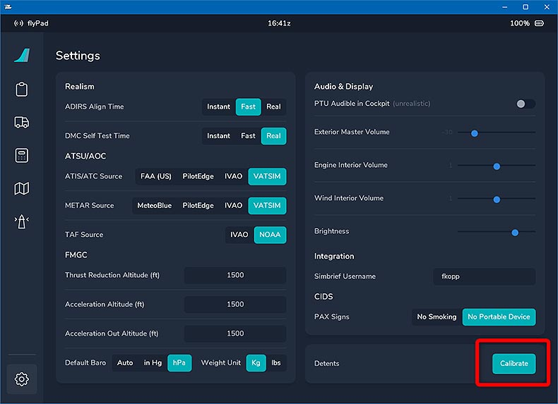{loading=lazy}

    Throttle Calibration Page:

    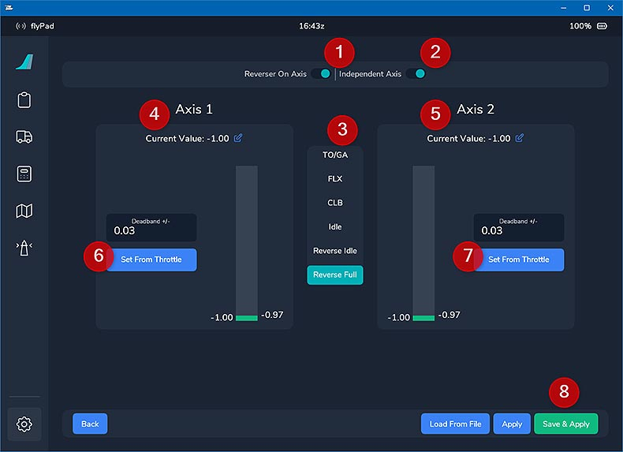{loading=lazy}

- Set **`Reverser On Axis`**  to ON (see **1** in image).

- Set **`Independent Axis`** to ON (see **2** in image).

- Click on **`Reverse Full`** in the middle **(3)**
    - Confirm that the value for Axis 1 **(4)** and Axis 2 is -1.0 (or very close to).

    !!! info ""
        To get the current throttle values it might be necessary to move the mouse outside the EFB window if you popped out the window with ++ralt+left-button++

- Click on **`Set From Throttle`** for Axis 1 **(6)** and Axis 2 **(7)**.

#### Reverse Idle

- Move your TCA throttle forward until the **Reverse Levers** snap back and then pull the **Reverse Levers** up again and move the throttle back a bit. There is no detent for **Reverse Idle** so just make sure it is not all the way back but well out of the **Idle Detent**.

    !!! info ""
        To get the current throttle values it might be necessary to move the mouse outside the EFB window if you popped out the window with ++ralt+left-button++

    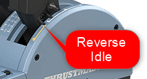{loading=lazy}

- Click on **Reverse Idle** in the middle **(3)**
- Click on **Set From Throttle** for Axis 1 **(6)** and Axis 2 **(7)**.

    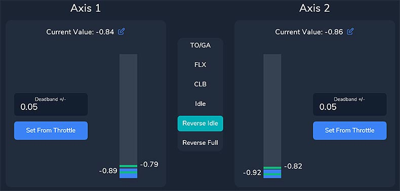{loading=lazy}

    !!! info ""
        Notice how the blue bar (current throttle position) is between two  green lines. These green lines are your dead zone or dead band for the detent. As long as the blue bar is between them, the throttle reads this as the corresponding detent (in this case **Reverse Idle**). If you move the throttle outside these green bars they become gray as you now no longer are in the corresponding detent.

        You can enlarge the dead band by increasing the value above the "Set From Throttle" button. Currently this is 0.05 - set it as required which will move the green lines down/up. Usually the default values are sufficient.

#### Idle

- Move the TCA throttle into the IDLE detent by moving it forward until the **Reverse Levers** snap back then pull the throttle levers back against the reverse lock.
- Click on **Idle** in the middle **(3)**.
- Click on **Set From Throttle** for Axis 1 **(6)** and Axis 2 **(7)**.

    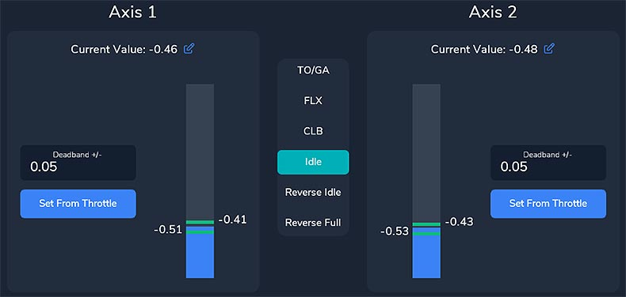{loading=lazy}

#### CLB

- Move the TCA throttle forward one detent (CLB detent).
- Click on **CLB** in the middle **(3)**.
- Click on **Set From Throttle** for Axis 1 **(6)** and Axis 2 **(7)**.

    {loading=lazy}

#### FLX/MCT

- Move the TCA throttle forward one detent (FLX/MCT detent).
- Click on **FLX** in the middle **(3)**.
- Click on **Set From Throttle** for Axis 1 **(6)** and Axis 2 **(7)**.

    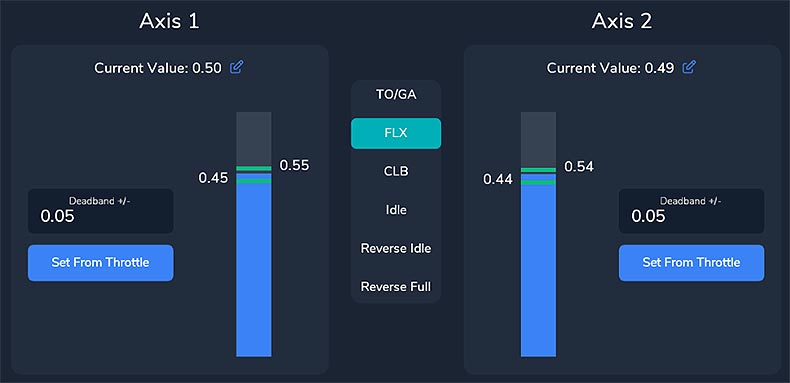{loading=lazy}

#### TOGA

- Move the TCA throttle all the way forward (TO GA).
- Click on **TOGA** in the middle **(3)**
- Click on **Set From Throttle** for Axis 1 **(6)** and Axis 2 **(7)**.

    {loading=lazy}

- Click on "SAVE AND APPLY" **(8)**

    {loading=lazy}

- Test each setting with a view like this. Make sure the mouse is outside the popout window otherwise the aircraft's throttles won't move.

    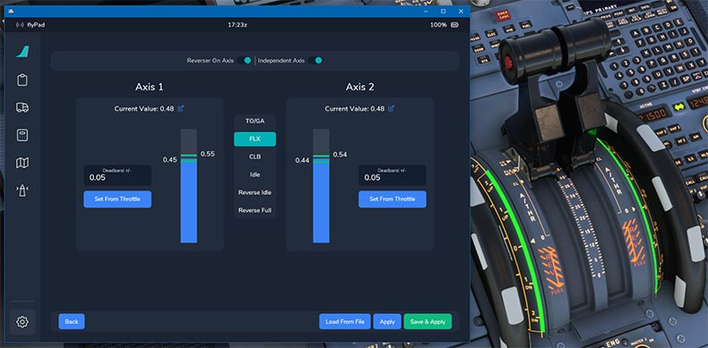{loading=lazy}

**Congratulations! You have successfully calibrated your TCA Throttle!**

## Thurstmaster TWCS or similar without Reverser on Axis and no Detents

This section describes the calibration of a single axis throttle with no Reverser on Axis and also no detents.

Example Thrustmaster TWCS Throttle:

{loading=lazy}

The configuration is very similar to the above TCA therefore we are only describing the differences to the settings above. Read the above section when something is unclear.

### Step 1: Microsoft Flight Simulator Controls Option

#### Throttle Sensitivity

Same as described above remove all sensitivity settings and make it linear. Be aware that your throttle might use different names for the axis. Move the throttle to see which graph is moving.

{loading=lazy}

#### Throttle Mapping

Instead of `Throttle Axis 1/2` throttles without **Reverser on Axis** often need the `Throttle Axis 1/2 (0 TO 100%)` setting. Some need the `Reverse Axis` box checked, some not. Find the right setting for your throttle by trial and error.

"){loading=lazy}

### Step 2: Calibrating the TCA throttle detents in the FlyByWire flyPad (EFB)

- Go to the flyPad Throttle Calibration page

    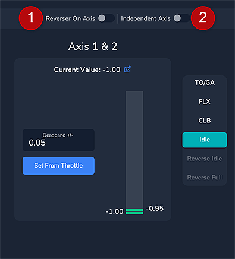{loading=lazy}

- As this throttle has no reverse and only one real axis set the `Reverser on Axis` to OFF **(1)** and also the `Independent Axis` to OFF **(2)**

- Move the throttle all the way back to idle.

- As described above we go through all detents and set the values accordingly with `Set From Throttle`. The easiest way to do that is by having the flyPad in a separate window next to the throttle as in the screenshot below.

    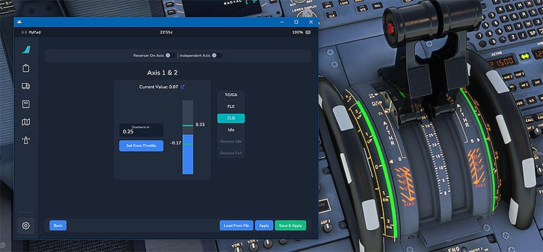{loading=lazy}

- For the detents CL, FLX and TO GA you can increase the dead zone to make it easier to move your throttle into the detents.

    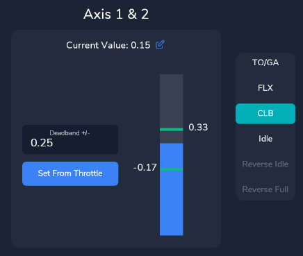{loading=lazy}

    In this example we have set the dead zone to 0.25 on either side of the actual setting. For FLX and TO GA you can use 0.10 or 0.15.

  - Click on "SAVE AND APPLY" **(8)** and test everything

      {loading=lazy}

**Congratulations! You have successfully calibrated your throttle!**

## Troubleshooting

TODO
- red text --> not able to save

## Manual way with configuration file (only experts)

TODO
- ThrottleConfiguration.ini

## Additional video guides

[FBW Tool-Tips | Throttle Calibration](https://www.youtube.com/watch?v=8yZuv2L4jPA&list=PLyIyZ4OtCKhxTSKfpwxxFEROEjAaKta7j)

<iframe width="790" height="450" src="https://www.youtube.com/embed/8yZuv2L4jPA?list=PLyIyZ4OtCKhxTSKfpwxxFEROEjAaKta7j" title="YouTube video player" frameborder="0" allow="accelerometer; autoplay; clipboard-write; encrypted-media; gyroscope; picture-in-picture" allowfullscreen></iframe>

[FBW Tool-Tips | Throttle Calibration](https://www.youtube.com/watch?v=8yZuv2L4jPA&list=PLyIyZ4OtCKhxTSKfpwxxFEROEjAaKta7j)
[Flybywire A32NX Throttle Calibration Tutorial](https://www.youtube.com/watch?v=9oqFfAMXCcc)

<!--
<iframe width="790" height="450" src="https://www.youtube.com/embed/9oqFfAMXCcc" title="YouTube video player" frameborder="0" allow="accelerometer; autoplay; clipboard-write; encrypted-media; gyroscope; picture-in-picture" allowfullscreen></iframe>
-->

