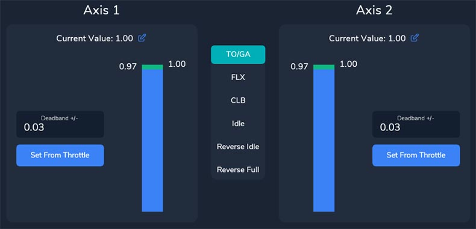

# Throttle Calibration FlyByWire A32NX

## TCA or similar (with reverser on axis)

{loading=lazy}

### Step 1: Microsoft Flight Simulator Controls Option

Open the Microsoft Flight Simulator Controls Option page.

{loading=lazy}

Use the numbers in this image in the following text.

{loading=lazy}

- Select the TCA controller **(1)**

- Click on **SENSITIVITY** **(2)**

    Make sure sensitivity setting are set to linear. Set them exactly as per image below.

    {loading=lazy}

    Click on **DONE**

- Open **POWER MANAGEMENT - THROTTLE** **(3)**

    You should see the currently assigned control mappings. If not use FILTER **(6)** to see all controllable attributes.

    !!! warning "Important"
        Make sure **^^NOT^^** to use THROTTLE 1 AXIS (0 TO 100%) or THROTTLE 2 AXIS (0 TO 100%).

        Remove any mapping to these settings by doppelclicking the entry and choosing **CLEAR CURRENT INPUT**.

        {loading=lazy}

    Look for THROTTLE 1 AXIS and THROTTLE 2 AXIS and map it like this **(4)**:

    {loading=lazy}

    Test it by moving the TCA throttle - the white bar should move **(5)**.

- Exit the Control Options dialog and don't forget to **APPLY AND SAVE**!

Now Microsoft Flight Simulator should be setup correctly. The throttles should already move from Full Reverse to TOGA!

Now let's calibrate the detents as they are **NOT** correct yet - continue with the next chapter.

### Step 2: Calibrating the TCA throttle detents in the FlyByWire flyPad (EFB)

#### Full Reverse

- Make sure that your TCA throttles are all the way back to Full Reverse

    {loading=lazy}

- Open the flyPad (maybe pop it out to a separate window next to the throttle with ++ralt+left-button++) and go to **Settings** -> **Calibrate**

    {loading=lazy}

    {loading=lazy}

    Throttle Calibration Page:

    {loading=lazy}

- Set **`Reverser On Axis`**  to ON (see **1** in image)

- Set **`Independent Axis`** to ON (see **2** in image)

- Click on **`Reverse Full`** in the middle **(3)**
    - Confirm that the value for Axis 1 **(4)** and Axis 2 is -1.0 (or very close to).

    !!! info ""
        It might be necessary to move the mouse outside the EFB window if you popped out the window with ++ralt+left-button++ to get the current throttle values

- Click on **`Set From Throttle`** for Axis 1 **(6)** and Axis 2 **(7)**.

#### Reverse Idle

- Move your TCA throttle to the IDLE detent and then pull the **Reverse Levers** up and the throttle back a bit. There is no detent for **Reverse Idle** so just make sure it is not all the back but well out of the **Idle Detent**.

    !!! info ""
        It might be necessary to move the mouse outside the EFB window if you popped out the window with ++ralt+left-button++ to get the current throttle values

    {loading=lazy}

- Click on **Reverse Idle** in the middle **(3)**
- Click on **Set From Throttle** for Axis 1 **(6)** and Axis 2 **(7)**.

    {loading=lazy}

    !!! info ""
        Notice how the blue bar (current throttle position) is between two  green lines. These green lines are your zone for the detent. As long as the blue bar is between them, the throttle reads this as the corresponding detent (in this case **Reverse Idle**). If you move the throttle outside these green bars they become gray as you now longer are in the corresponding detent.

        You can enlarge the zone by increasing the value above the "Set From Throttle" button. Currently this is 0.05 - set it as required which will move the green lines down/up. Usually the default values are sufficient.

#### Idle

- Move the TCA throttle into the IDLE detent by moving it forward until the **Reverse Levers** snap back then pull the throttle levers back against the reverse lock.
- Click on **Idle** in the middle **(3)**.
- Click on **Set From Throttle** for Axis 1 **(6)** and Axis 2 **(7)**.

    {loading=lazy}

#### CLB

- Move the TCA throttle forward one detent (CLB detent).
- Click on **CLB** in the middle **(3)**.
- Click on **Set From Throttle** for Axis 1 **(6)** and Axis 2 **(7)**.

    {loading=lazy}

#### FLX/MCT

- Move the TCA throttle forward one detent (FLX/MCT detent).
- Click on **FLX** in the middle **(3)**.
- Click on **Set From Throttle** for Axis 1 **(6)** and Axis 2 **(7)**.

    {loading=lazy}

#### TOGA

- Move the TCA throttle all the way forward (TO GA).
- Click on **TOGA** in the middle **(3)**
- Click on **Set From Throttle** for Axis 1 **(6)** and Axis 2 **(7)**.

    {loading=lazy}

- Click on "SAVE AND APPLY" **(8)**

    {loading=lazy}

- Test each setting with a view like this. Make sure the mouse is outside the popout window otherwise the aircraft's throttles won't move.

    {loading=lazy}

**Congratulations! You have successfully calibrated your TCA Throttles!**

## Troubleshooting

TODO

## Manual way with configuration file (only experts)

TODO

## Additional video guides

[FBW Tool-Tips | Throttle Calibration](https://www.youtube.com/watch?v=8yZuv2L4jPA&list=PLyIyZ4OtCKhxTSKfpwxxFEROEjAaKta7j)
[Flybywire A32NX Throttle Calibration Tutorial](https://www.youtube.com/watch?v=9oqFfAMXCcc)

