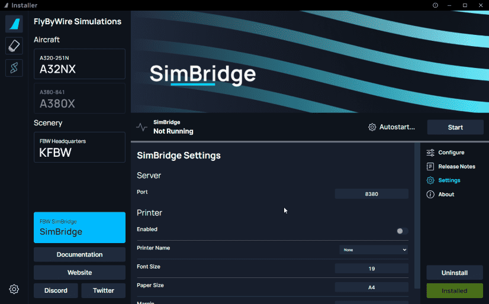
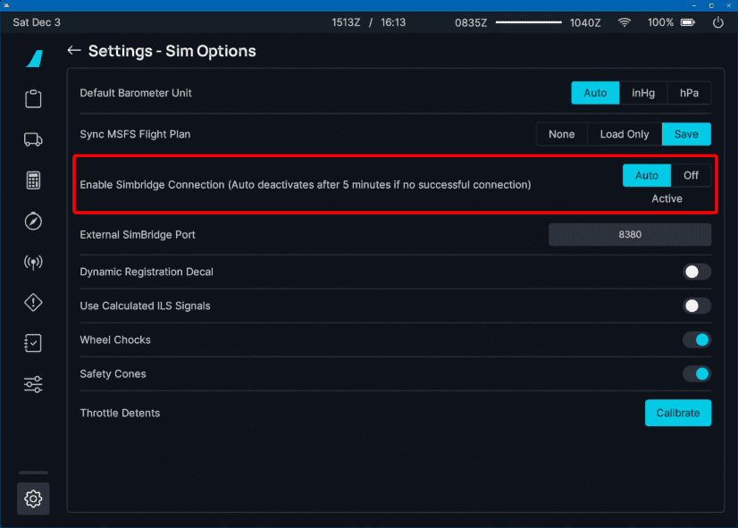

<link rel="stylesheet" href="../../../stylesheets/web-mcdu.css">

# Configuration
You can configure SimBridge to provide you with options that best suit your needs.

{loading=lazy}

!!! info Make sure to save
    Make sure to `Save` or `Discard` any settings you might've changed in order for the settings to be reflected in SimBridge.

!!! warning Notice 
    If SimBridge is running, make sure to stop and then start the service in order for SimBridge to load the modified settings.

## Server Settings
This tab is dedicated to settings regarding the SimBridge server itself.

- Port
    - You can modify SimBridge's hosted port.
    - Default: `8380`
    !!! warning "Notice"
        If this is changed, make sure to reflect the same port in the [EFB](../../../aircraft/common/flypados3/settings.md#sim-options).

## Printer Settings
This tab is for modifying settings regarding printing data from the MCDU to your physical printer.

- Enabled
    - A simple option to enable or disable the printer function as a whole.
    - Default: `False`
- Printer Name
    - This is a dropdown list that lists all the available printers on your network.
    - Default: `None`
-  Font Size
    - Modify the font size of printed content, useful for special size printers.
    - Default: `19`
 - Paper Size
    - Modify the paper size, useful for special size printers.
    - Default: `A4`
    !!! danger "Notice"
        Selecting an invalid paper size will cause an error when attempting to print
-  Margin
    -  Defines the margins for the printout.
    -  Default: `30`

??? info "Supported Paper Sizes (click to expand)"
    Based on this list: [PDFKIT Paper Sizes](https://pdfkit.org/docs/paper_sizes.html){target=new}

    - A-series: A0 ... A10
    - B-series: B0 ... B10
    - C-series: C0 ... C10
    - RA-series: RA0 ... RA4
    - SRA-series: SRA0 ... SRA4
    - Common U.S. sizes
        - EXECUTIVE
        - LEGAL
        - LETTER
        - TABLOID
    - Other
        - 4A0
        - 2A0
        - FOLIO

    The exact size can be found here:
    [Overview_of_ISO_paper_sizes](https://en.wikipedia.org/wiki/Paper_size#Overview_of_ISO_paper_sizes){target=new}

## Aircraft Settings

To use the SimBridge, the aircraft's settings need to allow the SimBridge connection.

!!! warning ""
    To find the following settings, load into our aircraft within the simulator and use our onboard EFB (flyPad).

    The page below is found on the flyPad EFB under `Settings` > `Sim Options`.

{loading=lazy}

The three settings are:

- Auto:
    - The aircraft attempts to connect to SimBridge for 5 min after pressing "Ready to Fly" (`Active` is shown).
    - If this setting is selected, the displays will try to connect to SimBridge for 5 min after every start of a new flight.
    - After 5 min of unsuccessful connection attempts, the aircraft will stop any further attempts and `Inactive` will be shown.
    - If `Inactive` is shown, but you want to connect to SimBridge just click on `Off`, wait a few seconds and then click on `Auto` again.
- Off:
    - The displays will not make any attempts to connect to SimBridge.

!!! warning "Timeout for SimBridge Connection Attempts"
    If the aircraft can not connect to SimBridge within 5 min the aircraft will stop any further attempts and `Inactive` will be shown. If `Inactive` is shown, but you want to connect to SimBridge, just click on `Off`, wait a few seconds and then click on `Auto` again.
