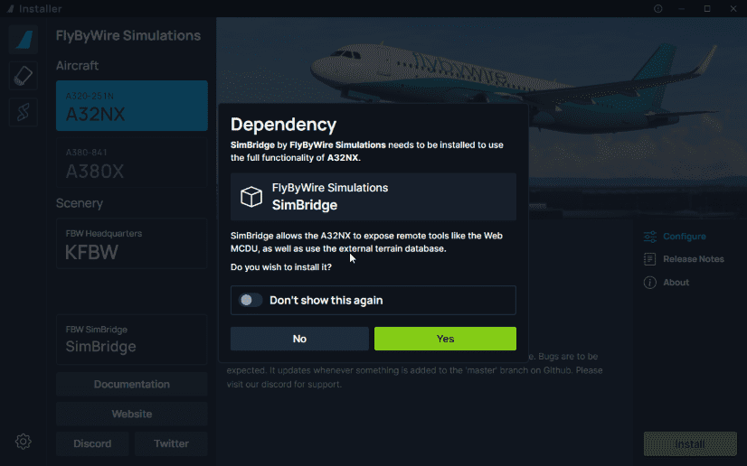
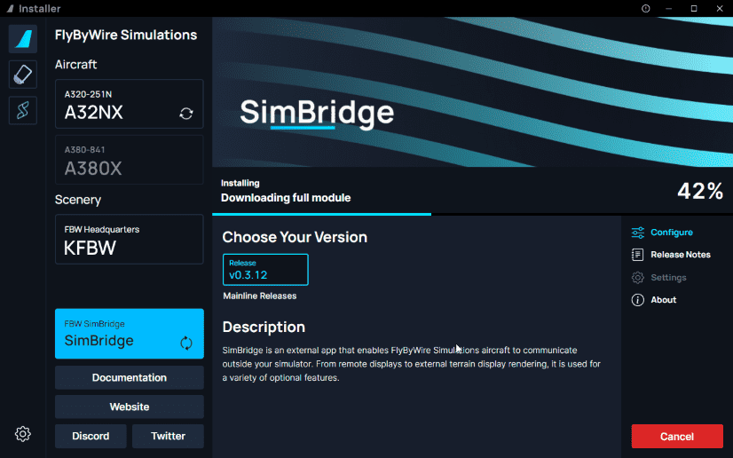
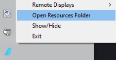
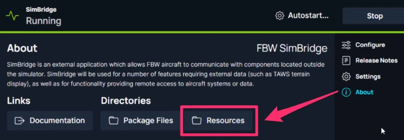
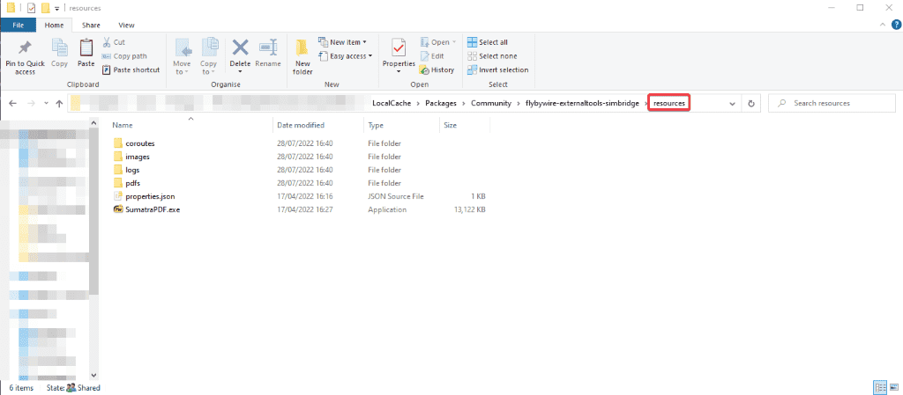
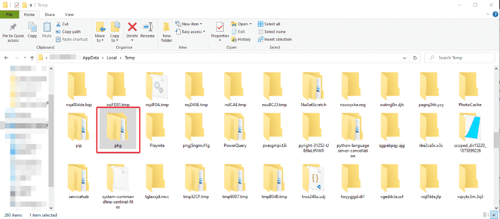

# Installation Guide

Please follow the information on this page to install the FlyByWire SimBridge tools for FlyByWire aircraft.

*Last Update: {{git_revision_date_localized}}*

## Downloads

### FlyByWire Installer

#### Add-on Install

When you attempt to install an add-on or different add-on version (for example, switching from Stable to Development) you will be prompted to install SimBridge

{loading=lazy}

Select `Yes` to install SimBridge along with your chosen addon/version.

#### Separate Install

If you select `No` in the [Add-on Install](#add-on-install) or would like to separately install SimBridge, then you can install SimBridge by selecting the SimBridge tab.

On the SimBridge tab, select install and the installer will go ahead and install SimBridge.
{loading=lazy}

#### Installer Debug Logs

You can send us logs to our [Discord](https://discord.gg/flybywire){target=new} for support if you encounter issues with the installer. Please follow the steps below:

  * Open the debug tool ++CTRL+F12++.

  * Find and select ++"Console"++ in the top menu.

  * ++"Right Click"++ anywhere in the log displayed.

  * Click ++"Save as"++ and send the log to us.

[Download Installer](https://api.flybywiresim.com/installer){ .md-button target=new}

### Manual Installation

!!! warning 
    Using this method means autostart won't be enabled

    [Download Latest](https://github.com/flybywiresim/simbridge/releases/latest/download/fbw-simbridge.zip){ .md-button target=new}

## Community Folder

- Extract the `.zip` file and rename the folder to `flybywire-externaltools-simbridge`.

### Microsoft Store and/or Game Pass Edition

- Copy the `flybywire-externaltools-simbridge` folder into your community package folder.

It is located in:

* `C:\Users\[YOURUSERNAME]\AppData\Local\Packages\Microsoft.FlightSimulator_<RANDOMLETTERS>\LocalCache\Packages\Community`.

---

### Steam Edition

- Copy the `flybywire-externaltools-simbridge` folder into your community package folder.

It is located in:

* `C:\Users\[YOUR USERNAME]\AppData\Roaming\Microsoft Flight Simulator\Packages\Community`.

---

### Boxed Edition

- Copy the `flybywire-externaltools-simbridge` folder into your community package folder.

It is located in:

* `C:\Users\[YOUR USERNAME]\AppData\Local\MSFSPackages\Community`.

---

### Troubleshooting

See [find the community folder](../../../aircraft/install/installation.md#Troubleshooting)

## Resources Folder
The resources folder is used for storing various files required by SimBridge to provide its functionality. 
 
Finding/Opening the resources folder can be done through several paths:

- Tray Icon
    - You can right-click the tray-icon and select `Open resources folder` which will open the path in your windows 
     explorer

    {loading=lazy}

- Installer
    - Within the FBW installer on the SimBridge tab, you'll find the resources folder button under `About` on the right menu, which will open the path in your Windows-Explorer
  
    {loading=lazy}

- Windows-Explorer
    - You can navigate to the [community folder](#community-folder) where you will find 
     `flybywire-externaltools-simbridge` in there you can find the `resources` folder
  {loading=lazy}

## Clean Install Steps

!!! danger Notice
    If you uninstall SimBridge, your resources folder is also cleared, deleting all of your images, PDFs etc. that you have stored there. 
    
    Make sure to back them up before doing so if you intend to keep this data.

### Automatic Clean Install

FBW Installer introduced the `Uninstall` feature. To perform an automatic clean install:

- Ensure you have the latest FBW Installer on your machine. 
    - The installer updates itself. If you would like to download our installer again, see the [FlyByWire Installer Section](#flybywire-installer).
- Click on the "Uninstall" button.

!!! tip ""
    This removes the tool from your community folder and the extra files in `%temp%`.

### Manual Clean Install

If you would like to manually perform a clean install you first have to delete the 
 `flybywire-externaltools-simbridge` folder from your community folder.

We also store additional information related to the tool in a separate directory, which is built when you load the tool. You also need to delete the folder.

These locations are found below:

- `%temp%`

If the above folders are hidden to you, follow the directions on [Microsoft's support site](https://support.microsoft.com/en-us/windows/view-hidden-files-and-folders-in-windows-10-97fbc472-c603-9d90-91d0-1166d1d9f4b5).

Once in the correct directory, delete the folder shown here:

{loading=lazy}