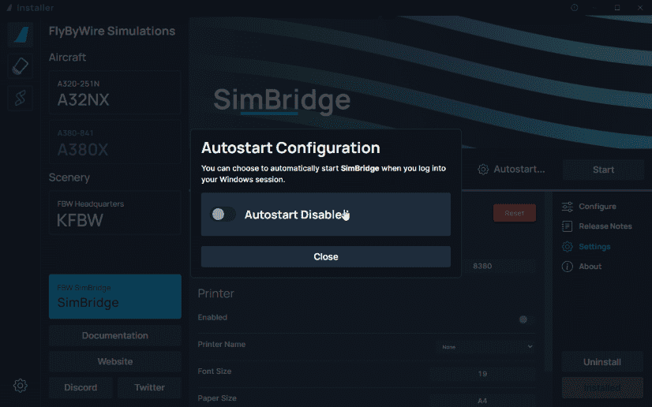
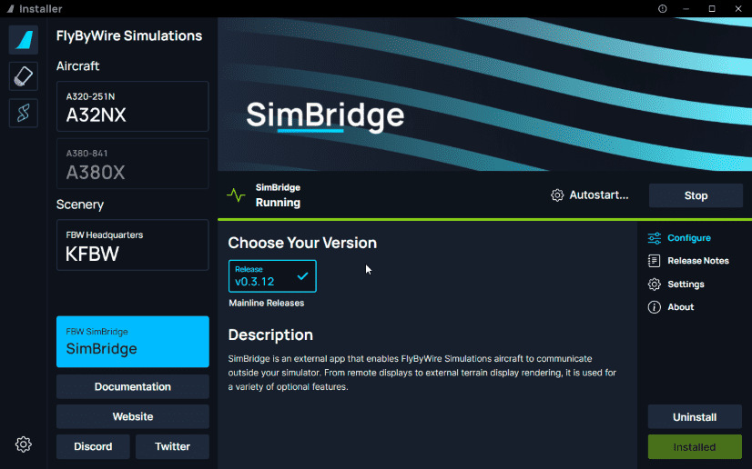
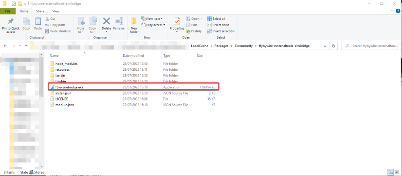
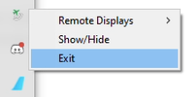
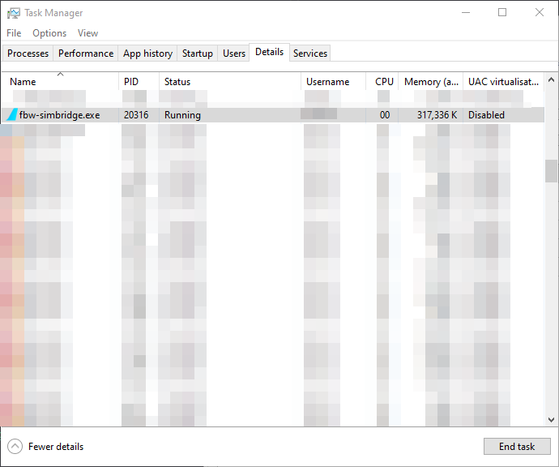

# Starting SimBridge

## Autostart

Autostart is a feature provided by the FlyByWire Installer that allows SimBridge to be autostarted upon Windows start. SimBridge will live in the system tray, similar to Navigraph Simlink. 

### Configuration

Upon installation of SimBridge you will be prompted to enable autostart, You can choose to enable or disable autostart. 

!!! info Notice
    If you choose to have autostart disabled, you can still start SimBridge from the installer

## Manual Start

If you choose not to enable autostart, you can open SimBridge via the installer. Just select the `Start` button.

If this is not your preference, or it fails to start, you can also open the tool by opening the `fbw-simbridge.exe` found in the folder, `flybywire-externaltools-simbridge`, in the [community folder](../../../aircraft/install/installation.md#Troubleshooting).

## Stopping SimBridge
There are several avenues to stop SimBridge to provide flexibility to you as the user, this also includes stopping SimBridge from a remote device.

### Installer
- The simplest way is via the installer and selecting the stop button on the SimBridge page.

### Tray Icon
- By right-clicking the tray icon in your system tray and selecting `Exit`, you can also stop SimBridge.

    {loading=lazy}

### API Endpoint
- You can stop SimBridge by calling the health endpoint via http://{[host machine IP](../troubleshooting.md#network-configuration)}:{[selected port](configuration.md#server-settings)}/health/kill
- For example `https://192.168.1.21:8380/health/kill`

### Task Manager
- If you encounter issues when closing SimBridge normally, you can kill the `fbw-simbridge.exe` process in Task Manager.
{loading=lazy}