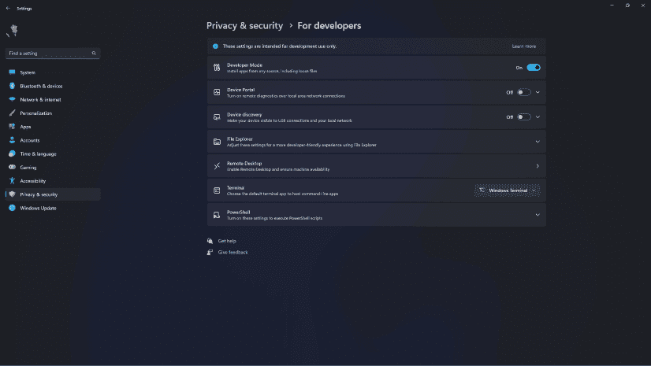

# Troubleshooting

## Timeout for SimBridge Connection Attempts

Due to issues in the Microsoft Flight Simulator Coherent Engine (JavaScript Engine) continuous connection attempts lead to performance problems for some users because of how the engine handles unsuccessful connections.

Therefore, a timeout mechanism has been built into the aircraft's SimBridge client limiting the number of connection attempts, it will execute.

A setting in the flyPad Settings SimOptions page has been introduced to allow users to restart the connection attempts or to turn off the attempts to connect to SimBridge completely.

{loading=lazy}

If the aircraft can not connect to SimBridge within 5 min, the aircraft will stop any further attempts and `Inactive` will be shown. If `Inactive` is shown, but you want to connect to SimBridge, just click on `Off`, wait a few seconds and then click on `Auto` again.

Check this page for more details: [SimBridge Aircraft Settings](install-configure/configuration.md#aircraft-settings)

## Main Window
By default, SimBridge's main window starts hidden in the system's tray, to view it, select `Show/Hide` on the system's tray icon.

{loading=lazy}

The main window running SimBridge displays the server's log file information and provides important information about the started services, the necessary URLs and IP addresses.

!!! info "Note"
    This window does not need to remain open and can be re-hidden using the system's tray icon.

    !!! warning "Windows 11 Changes"
        A recent update to Windows 11 made `Windows Terminal` the default console (replacing `console host`). Unfortunately, at this time, `Windows Terminal` does not support being minimized to the tray.

        If you would like to revert back to `console host` to regain the hide to system tray function, please see [Windows 11 System Tray Instructions](#windows-11-system-tray-instructions) below.

!!! warning "Notice"
    If the main window is closed (via the (X) button), SimBridge will be closed entirely and will need to be [restarted](install-configure/start-simbridge.md#manual-start).

### Windows 11 System Tray Instructions

With the `Windows 11 22H2` update, `Windows Terminal` is now the default terminal on Windows 11.

As described earlier, `Windows Terminal` no longer supports being minimized to the tray. The instructions below detail how to regain this functionality at the expense of changing your "default console".

!!! warning ""
    Please note that switching your default terminal to console host will mean that you lose access to `Windows Terminal` unless you specifically wish to open it.

Steps to regain functionality:

- Open settings, and navigate to `Privacy & Security --> For Developers`

    ??? info "Example (Click to Expand)"
        {loading=lazy}

- Set Terminal to `Windows Console Host`

    ??? info "Example (Click to Expand)"
        {loading=lazy}

- Close the settings app and open SimBridge, it should now open in the legacy Windows Console Host.

    ??? info "Example (Click to Expand)"
        {loading=lazy}

SimBridge should now be able to be minimized to the tray appropriately.

## FlyPad Settings

The EFB will stop trying to connect to SimBridge after a 5-minute timer.
Check the connectivity status on the EFB by checking if the Wi-Fi icon on the top is crossed.
{loading=lazy}

Icon Crossed             |  Icon Normal
:-------------------------:|:-------------------------:
{loading=lazy}  |  {loading=lazy}

- If the Wi-Fi / connectivity icon is crossed, head to the flyPad Settings --> Sim Options 

FlyPad Settings            |  Sim Options
:-------------------------:|:-------------------------:
{loading=lazy}  |      {loading=lazy}

To attempt connection:

- SimBridge Connection: Turn "AUTO" to "OFF" for a few seconds.
- Select "AUTO" again.
  
## Network Configuration

To access SimBridge's remote displays from a remote device, you need to make sure that this device is on the same network as the PC running the MCDU Server.

This is typically the case if both, the PC and the device use the same Internet router and the same Wi-Fi.

To check this, you can look at the IP address the MCDU server has listed in its [main window](#main-window) while starting.

In the example above, the IP address is `192.168.1.19`.

Your device should typically have an IP Address starting with the same three sets of numbers (starting with 192.168.1 in this case). This is a good way to quickly verify that your remote device is even on the same network.

You can confirm your device is on the same network on that device's network configuration. See tip below.

??? tip "Examples for Device Network Information (click to expand)"
    **iPad:**

    {loading=lazy}

    **Samsung Android:**

    {loading=lazy}

If you still can't connect to SimBridge's remote displays, your firewall might be blocking the traffic. See next chapter.

## Firewall Configuration

!!! danger "Disclaimer"
    Changing Windows settings, especially security settings like the firewall, comes with certain risks. Please do not change these settings if you are not comfortable doing so. FlyByWire Simulations does not take any responsibility for any issues caused by your changes to Windows or security settings.

If you can't reach SimBridge's remote display from your browser on your device or on your local PC, then it is very likely that your PC firewall is blocking this network traffic.

To test and confirm this, turn off your firewall and try again to reach a [remote-display](simbridge-feature-guides/remote-displays/remote-mcdu.md) via your browser. If you now can access your MCDU from your browser, you have confirmed that it is indeed the firewall that blocks this access.

{==

 **Turn the firewall back on again.**<br/>
 *(never run a PC without a firewall)*

==}

We now know we need to open the port we want to use. The default port is **TCP 8380** and this must be allowed to pass the firewall.

There are several ways to open ports on your PC firewall.

For the Windows Firewall, you can follow this guide here:

[Opening a Port on Windows Firewall Instructions](https://www.howtogeek.com/394735/how-do-i-open-a-port-on-windows-firewall/){target=new  .md-button }

Alternatively, you can open a Command Line prompt or Windows PowerShell as Administrator and use this command:

``` cmd title="Windows Command Line/Powershell"
netsh advfirewall firewall add rule name="Local API Server" dir=in action=allow protocol=TCP localport=8380
```

For an advanced guide of this command, see the Microsoft documentation:<br/>
[netsh advfirewall firewall](https://docs.microsoft.com/en-US/troubleshoot/windows-server/networking/netsh-advfirewall-firewall-control-firewall-behavior){target=new}

??? warning "Remove Autogenerated Rules (click to expand)"
    Sometimes Windows has already automatically generated some rules after showing you a firewall dialog when starting SimBridge.

    If you still can't connect to SimBridge, these rules might be the cause. After adding your own rule as described above, you don't need these anymore, and they can be deleted.

    They usually look like this:

    {loading=lazy}

    The Windows Dialog creating these automatic rules looks like this:
    {loading=lazy}

This should now allow access from your browser to SimBridge's remote display.

## Occupied Port

Sometimes the default port 8380 is already used by other services on your PC.

In this case, you should get error messages similar to this:

``` cmd title="Windows Command Line"
Error: listen EADDRINUSE: address already in use :::8380
```

??? tip "How To Check If a Port is Already In Use? (click to expand)"
    You can see if a port is occupied by making sure the Local API Server is off and then running this command:

    Windows Command Line:
    ``` cmd title="Windows Command Line"
    netstat -ano | find "8380"
    ```
    or
    Windows PowerShell:
    ``` cmd title="Windows PowerShell"
    netstat -aon | findstr 8380
    ```

    If the corresponding port is already in use, the output should be similar to this:
    ``` cmd title="Output"
      TCP    0.0.0.0:8380       0.0.0.0:0              LISTENING       4
      TCP    [::]:8380          [::]:0                 LISTENING       4
      ...
    ```

If the port is indeed already occupied, then you need to change the default port in [SimBridge Configuration](install-configure/configuration.md#server-settings).

You also need to change the port in the [flyPad EFB Sim options page](../../aircraft/common/flypados3/settings.md#sim-options).

Of course, now the firewall might have to be opened for this new port.

## simbridge.local (mDNS)

!!! danger "Disclaimer"
    Changing Windows settings, especially security settings like the firewall, comes with certain risks. Please do not change these settings if you are not comfortable doing so. FlyByWire Simulations does not take any responsibility for any issues caused by your changes to Windows or security settings.

Once you have made sure that SimBridge's remote display is accessible via the IP address, your firewall might be blocking mDNS packets, preventing you from accessing it via `simbridge.local`.

To test and confirm this, turn off your firewall and try again to reach `simbridge.local` via your browser. If you can now access your MCDU from your browser, you have confirmed that it is indeed the firewall that blocks this access.

{==

 **Turn the firewall back on again.**<br/>
 *(never run a PC without a firewall)*

==}

We now know we need to open the port we want to use. The mDNS port is **UDP 5353**, and it must be allowed to pass the firewall in _both_ directions.

There are several ways to open ports on your PC firewall.

For the Windows Firewall, you can follow this guide here:

[Opening a Port on Windows Firewall Instructions](https://www.howtogeek.com/394735/how-do-i-open-a-port-on-windows-firewall/){target=new  .md-button }

Alternatively, you can open a Command Line prompt or Windows PowerShell as Administrator and use these commands:

``` cmd title="Windows Command Line/PowerShell"
netsh advfirewall firewall add rule name="simbridge.local mDNS (in)" dir=in action=allow protocol=UDP localport=5353
netsh advfirewall firewall add rule name="simbridge.local mDNS (out)" dir=out action=allow protocol=UDP remoteport=5353
```

For an advanced guide of this command, see the Microsoft documentation:<br/>
[netsh advfirewall firewall](https://docs.microsoft.com/en-US/troubleshoot/windows-server/networking/netsh-advfirewall-firewall-control-firewall-behavior){target=new}

??? warning "Remove Autogenerated Rules (click to expand)"
    Sometimes Windows has already automatically generated some rules after showing you a firewall dialog when starting SimBridge.

    If you still can't connect to `simbridge.local` these rules might be the cause. After adding your own rule as described above, you don't need these anymore, and they can be deleted.

    They usually look like this:

    {loading=lazy}

    The Windows Dialog creating these automatic rules looks like this:
    {loading=lazy}

This should now allow access from your browser to SimBridge's remote display via `simbridge.local`.

## Log file
The log file contains all the messages printed by the main window, as well as debug messages.

The log file is stored in a file in this folder, formatted by date:
```
<YOUR_COMMUNITY_FOLDER>\flybywire-externaltools-simbridge\resources\logs
```
Please send us the latest log file to the support channel on discord or on GitHub issues if you're facing issues using the SimBridge's features.

## Installation and Upgrade

Sometimes the installation or the upgrade of SimBridge will fail with an Error during the [Installation](install-configure/installation.md). This happens when Simbridge is still running in the background, even though the Installer indicates it isn't.

Use the Windows Task Manager to stop the SimBridge process as described in the [Stopping SimBridge](install-configure/start-simbridge.md#stopping-simbridge) documentation, and then run the installation or upgrade again.